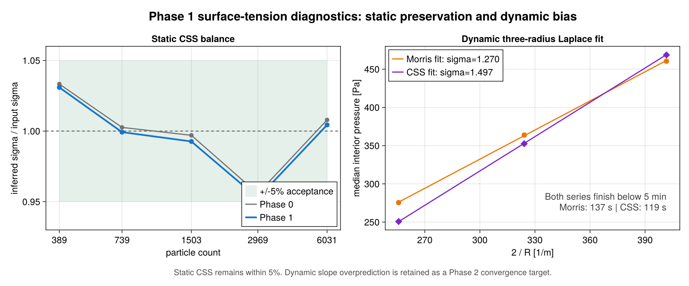

# CSS Surface Tension Transition Plan

Tracking document for replacing the Akinci surface tension model with a validated
continuum-surface-stress (CSS) model (`SurfaceTensionMomentumMorris`) as the recommended
production model in TrixiParticles.jl.

| Field | Value |
|---|---|
| Branch | `surface_tension_fix` (single PR, no upstream splitting) |
| Created | 2026-08-03 |
| Status | Phases 0-3 complete; R4-W production replay, D5 cleanup, and final G3 verification passed |
| Companion documents | `compare_akinci/README.md` (Akinci investigation and acceptance workflow) |

## Phase status

| Phase | Status | Gate |
|---|---|---|
| Phase 0 - Stabilize working tree | **Complete** | G0 closed |
| Phase 1 - Correct Morris and smooth activation | **Complete** | G1 closed |
| Phase 2 - Quantitative validation | **Complete** | G2 closed |
| Phase 3 - Contact mechanism decision | **Complete** | G3 closed |
| Phase 4 - Akinci-parity demonstrations | **In progress** - Figure 2 CSS bulk parity fails | G4 open |
| Phase 5 - Cleanup and handoff | Blocked by G4 | G5 open |

## Goal and success criteria

The Akinci (2013) model does not reliably work with WCSPH (see the Figure 8 investigation
in `compare_akinci/README.md`). The CSS model must be **at least the same quality as Akinci
in the cases shown by Akinci, but more reliable and scientifically accurate**. This is
operationalized as a two-track acceptance:

- **Track A - scientific accuracy (physical sigma).** Quantitative validation against
  analytic references: Young-Laplace pressure jump, Rayleigh droplet oscillation frequency,
  and zero-gravity sessile-drop contact angles. Convergence under refinement demonstrated
  and documented.
- **Track B - Akinci parity (calibrated sigma).** Side-by-side reproduction of the seven
  Akinci paper experiments in the `compare_akinci/` workbench, using per-case calibrated
  coefficients that are documented as such. CSS must match or beat the accepted Akinci rows
  on the per-case metrics, with stricter reliability requirements (no adaptive-dt collapse,
  stability under coefficient perturbation, two resolutions).

**Reliability** is defined throughout as: no sustained adaptive-timestep collapse under the
efficiency criteria in section 1.E, zero wall penetration, density within documented bounds,
and metric stability under +-20% coefficient perturbation. The capillary timestep is an upper
stability bound, not a lower bound on every accepted adaptive step.

## Scope decisions (agreed 2026-08-03)

1. **Contact-angle mechanism: benchmark decides, including rejection of both.** Both candidate
   mechanisms (geometric normal rotation, Breinlinger et al. 2013; contact-line force,
   Huber et al. 2016) remain behind an explicit selector. Phase 2 accepted their static
   target-preservation results, but Phase 3 rejected both as the recommendation because neither
   passed all off-target restoring-response cases.
2. **Two-track acceptance** as described above. Matching the paper's near-spherical resting
   drops at physical sigma is out of reach for physical reasons (Bond number ~5 for the 1 mL
   drop; capillary length 2.7 mm) and is not a gate.
3. **In scope besides CSS:** the smooth-cutoff reliability fix is shared with
   `SurfaceTensionMorris` (CSF); a surface-tension entry in `validation/`.
4. **Out of scope:** upstream PR splitting, full Morris-CSF validation campaign, GPU/backend
   support for the new caches, Riemann/Godunov WCSPH solvers, repulsive boundary models.

---

## Baseline: verified state of the working tree (2026-08-03)

### What already works

- CSS core (`SurfaceTensionMomentumMorris`, `src/schemes/fluid/surface_tension.jl:199`):
  retains the unnormalized color-gradient magnitude as surface delta (`delta_s`, x2
  one-sided factor in `store_surface_delta!`), symmetric scalar reproducing correction
  accumulated during the normal pass (`divergence_correction`), stress projection evaluated
  on demand in the pair force (no stored tensor, no extra neighbor pass), exact pairwise
  momentum conservation.
- Static Laplace balance validated (`compare_akinci/css_validation.jl`, unit test
  `test/schemes/fluid/surface_tension.jl` "CSS static Laplace balance"): pressure-fit sigma
  within 4.5% across 389-6031 particles, virial sigma converging toward the coefficient,
  total capillary force at roundoff.
- Capillary time-step bound `dt <= sqrt(rho h^3 / (2 pi sigma))` wired into
  `calculate_dt` (`src/schemes/fluid/fluid.jl:233-244`) for Morris, CSS, and
  `SurfaceTensionAkinciCohesionPhysical`; unit-tested.
- CLF plumbing exists for both solvers: `src/schemes/fluid/weakly_compressible_sph/rhs.jl:44`
  and `src/schemes/fluid/entropically_damped_sph/rhs.jl:28`.
- Workbench: `compare_akinci/css_sessile_drop.jl` (zero-g spherical-cap benchmark with
  damping and CLF diagnostics), `compare_akinci/css_validation.jl` (static balance),
  `compare_akinci/surface_tension_calibration.jl` (radius-series and instantaneous probes),
  seven Akinci example scripts in `examples/fluid/akinci_*.jl`.

### Baseline blockers and current disposition

- **B1 - RESOLVED IN PHASE 0: two half-finished contact-angle mechanisms competed for one
  keyword.**
  - Baseline: source implemented only CLF behavior while tests and prose expected geometric
    rotation; the geometric assertion failed.
  - Resolution: `GeometricContactAngle` and `ContactLineForce` now have separate dispatch and
    cache requirements, the geometric assertion passes, and all prose uses the explicit API.
- **B2 - RESOLVED IN PHASE 0: CLF internals had zero unit tests.** Wall-normal orientation,
  `delta'`, unclamped `delta_CL` sign, force direction, zero cases, and WCSPH/EDAC wiring are
  now covered by focused and integration tests.
- **B3 - RESOLVED IN PHASE 2: no accepted contact-angle results.** The complete 30-cell
  sessile-drop matrix now reports two angle estimators, settlement, density, penetration,
  timestep, and cost data; every cell passes the primary local-fit gate.
- **B4 - RESOLVED IN PHASE 1: adaptive-dt collapse and incorrect Morris force assembly.**
  Morris now applies `-sigma kappa delta_s n/rho` once per particle; Morris/CSS normals use C1
  gradient/support activity. The formerly blocked Morris radius series completes in 137 s.
- **B5 - RESOLVED IN PHASE 2: `validation/` had no surface-tension case.** Physical-sigma
  Young-Laplace, Rayleigh stiffness, sessile-drop, reference-data, plot, and CI drivers now
  live under `validation/surface_tension_2d/` and `validation/surface_tension_3d/`.

### Known physics limits (documented, not gates)

- WCSPH dummy-particle walls cannot statically support a compact resting drop: NNLS-solved
  pressure operators leave a mean vertical residual near -9.6 m/s^2 regardless of Adami
  offsets, mirroring, mDBC reflection, semi-analytic wall integrals, or 8x resolution
  (`compare_akinci/README.md`, Figure 8 investigation).
- Dynamically relaxed coarse CSS drops overpredict the Laplace pressure: inferred sigma
  1.50 / 1.36 / 1.16 N/m at 389 / 739 / 1503 particles for input 1 N/m - a first-order
  resolution error, converging under refinement.
- Free Rayleigh mode-2 trajectories develop tensile instability after roughly 1-2 periods.
  Phase 2 therefore validates their deterministic linear stiffness and retains the trajectory
  driver only as a diagnostic.
- Video-matching wetting shapes require sigma ~5 N/m (~69x water); physical sigma produces
  gravity-flattened drops at the paper's scale. Track B therefore uses calibrated sigma.

---

## Phase 0 - Stabilize the working tree

**Objective:** one consistent, fully tested code state with both contact-angle mechanisms
selectable. No behavior change for models without a contact angle.
**Estimate:** 2-3 working days. **Status:** complete (2026-08-03).

### Tasks

- [x] **0.1 Explicit contact-model selector.** Replace the `contact_angle::Real` overload of
      `ColorfieldSurfaceNormal` with explicit model types, e.g.
      `ColorfieldSurfaceNormal(contact_model=GeometricContactAngle(60.0))` and
      `ColorfieldSurfaceNormal(contact_model=ContactLineForce(60.0))` (final names: D1).
      Dispatch points to split:
  - `create_cache_surface_normal` (`boundary_normal` needed by both; `contact_line_delta`,
    `contact_line_delta_prime` only for CLF)
  - `apply_contact_angle!` (geometric: rotate interface normals; CLF: normalize wall normal
    only)
  - `contact_line_acceleration` (CLF only; returns zero otherwise)
  - `store_contact_line_delta_prime!` / `compute_contact_line_delta!` (CLF only)
  - The ambiguous, unshipped `contact_angle=theta` keyword was removed rather than retained
    as compatibility code (D1).
- [x] **0.2 Restore the geometric rotation implementation** with the exact semantics the
      existing test documents: for wall-contact particles with valid interface normal,
      `n_new = |n| * (sin(theta) t_hat + cos(theta) w_hat)` where `w_hat` is the unit wall
      normal (pointing into the wall) and `t_hat` the in-wall-plane unit projection of the
      interface normal. Magnitude preserved so `delta_s` is unaffected. Skip particles with
      no wall contact or vanishing tangent.
- [x] **0.3 Unit tests for CLF internals** (new testsets in
      `test/schemes/fluid/surface_normal_sph.jl`):
  - wall-normal orientation: accumulated `boundary_normal` points into the wall for a fluid
    particle above a plate
  - `delta' = |g| sin(theta_dyn)` on a constructed two-particle configuration
  - `delta_CL` sign on an analytic half-plane configuration; the `max(., 0)` clamp must not
    be what makes the test pass (assert the unclamped value is already positive)
  - CLF direction: for `theta_dyn > theta_target` the acceleration points out of the liquid
    along the wall (spreading); reversed for `theta_dyn < theta_target`
  - zero contributions for: no wall contact, zero tangent, `delta_CL = 0`
  - wiring parity: identical CLF acceleration through WCSPH and EDAC `interact!`
- [x] **0.4 Flat-pool guard test.** Tank with flat hydrostatic-free surface (zero g or
      damped): capillary acceleration must vanish (below tolerance) for interior particles
      AND for wall-adjacent bulk particles where `calc_boundary_normal!` completes the
      stencil. Guards the `delta_s` x2 one-sided factor against double counting with
      wall-completed quadrature.
- [x] **0.5 Geometric-path unit tests.** Port the failing `apply_contact_angle!` block to
      the geometric model type; add: magnitude preservation, no-op without wall contact,
      180/0 degree edge cases.
- [x] **0.6 Consistency pass over prose.** `ColorfieldSurfaceNormal` docstring, NEWS.md
      entry, `docs/src/systems/fluid.md`, and `compare_akinci/README.md` all state: two
      candidate mechanisms, selection pending the Phase 3 benchmark. Remove the premature
      "supports geometric contact angles" claim from NEWS.md.
- [x] **0.7 Unit test suite green**, including `test/schemes/fluid/surface_tension.jl`
      and `test/schemes/fluid/surface_normal_sph.jl`. Full simulation/example validation is
      intentionally deferred to the final validation campaign because it runs for over an hour.

### Exit gate G0

- [x] Unit tests pass; both mechanisms are selectable via one documented API; the no-contact
      path retains its original cache layout and behavior. The relevant 2D surface-tension
      examples passed before the intentionally stopped long-running examples campaign.

### Phase 0 evidence

- Focused surface-tension tests: 227/227 assertions passed.
- Focused surface-normal tests: 393/393 assertions passed, including the new 8-assertion
  flat-pool/contact-line integration test and the rigid/wall parity regression.
- Complete unit suite: passed through `Pkg.test` with `TRIXIPARTICLES_TEST=unit`.
- `compare_akinci/css_sessile_drop.jl` loads with the explicit `ContactLineForce` selector.
- JuliaFormatter 2.1.1 applied to all touched Julia files; `git diff --check` clean.
- The rigid-boundary `calc_boundary_normal!` call was updated to forward the boundary state
  required by the current boundary-density-aware signature; this fixed the pre-existing
  rigid/wall parity test failure exposed by the complete surface-normal test file.

---

## Phase 1 - Reliability: smooth force cutoffs (shared CSS + Morris CSF)

**Objective:** remove discrete on/off changes from capillary forces and correct the
neighbor-count-dependent Morris CSF force before evaluating its reliability. Fixes B4 for
`SurfaceTensionMomentumMorris` and `SurfaceTensionMorris` while preserving exact pairwise
momentum conservation of CSS.
**Estimate:** 4-6 working days. **Status:** complete (2026-08-03).

### 1.A Source audit and failure mechanism

Three independent discontinuities currently occur in `remove_invalid_normals!` and
`calc_curvature!`:

1. The raw color gradient is either normalized or set to zero at
   `h_c * norm(g_a) = interface_threshold`.
2. A particle is either retained or removed when its integer neighbor count crosses
   `ideal_density_threshold * ideal_neighbor_count`. A ramp applied to the integer count
   would still jump when a neighbor enters the support and is therefore not a sufficient fix.
3. Morris curvature includes a pair only when both unit normals are nonzero. A normal crossing
   either hard threshold changes the curvature stencil in one RHS evaluation.

There is also a separate Morris operator defect that must be corrected before interpreting the
timestep failure. `surface_tension_force!(::SurfaceTensionMorris, ...)` is called inside the
fluid-neighbor loop even though its result does not depend on the current neighbor. For a particle
with neighbor set ``\mathcal N_a``, the current call structure produces

```math
\bm a_a^\mathrm{current}
= -\frac{\sigma\kappa_a\hat{\bm n}_a}{\rho_a}
  \sum_{b\in\mathcal N_a} c_{ab},
```

where ``c_{ab}`` is the dimensionless free-surface correction (one when no correction is
selected). The force therefore scales with neighbor count and jumps by an entire local-force
contribution whenever the neighbor list changes. Since ``\hat{\bm n}`` is a unit vector, this
expression also lacks a surface delta and has units of ``m^2/s^2`` instead of acceleration.

The corrected Morris CSF acceleration is a particle-local source evaluated once per RHS:

```math
\bm a_a^\mathrm{CSF}
= -\frac{\sigma}{\rho_a}\,\kappa_a\,\delta_{s,a}\,\hat{\bm n}_a.
```

Here ``[\sigma]=kg/s^2``, ``[\kappa]=1/m``, ``[\delta_s]=1/m``, and
``[\rho]=kg/m^3``, so ``[\bm a]=m/s^2``. The Akinci pairwise free-surface correction is not
applied to this local continuum force; it remains available to the Akinci force and viscosity as
documented. CSS already deliberately ignores that correction.

### 1.B Continuous interface indicators

#### Raw color gradient

For particle ``a``, retain the existing color-gradient operator

```math
\bm g_a = \sum_b V_b\,\nabla_a W_{ab},
\qquad V_b=\frac{m_b}{\rho_b},
```

including the existing dummy-boundary quadrature completion. Its magnitude has units ``1/m``.
Define the dimensionless magnitude

```math
\gamma_a = h_c\lVert\bm g_a\rVert,
```

where ``h_c`` is the compact-support radius. This is exactly the quantity implicitly compared
with `interface_threshold` by the current condition
`norm(g_a) > interface_threshold / h_c`.

#### Continuous support moment

Replace the integer neighbor-count interior test for Morris/CSS only with the continuous first
kernel moment

```math
q_a = -\frac{1}{d}\sum_b V_b\,
      \bm r_{ab}\mathbin{\cdot}\nabla_a W_{ab}.
```

The continuum interior value is one. For a normalized compact kernel,

```math
0 = \int \nabla\mathbin{\cdot}(\bm r W)\,dV
  = d\int W\,dV + \int \bm r\mathbin{\cdot}\nabla W\,dV,
```

which gives ``q=1`` when the support is complete and ``q<1`` when it is truncated by a free
surface. Dummy boundary particles contribute to ``q_a`` even when they carry no capillary stress,
so a wall-adjacent bulk stencil remains near one. This moment is already accumulated as
`divergence_correction` for CSS; extend the same scalar accumulation to Morris without another
neighbor traversal.

Unlike neighbor count, ``q_a`` changes continuously as a particle crosses the support boundary:
for the supported kernels, ``W`` and the relevant derivatives vanish at the compact-support
radius. Keep `neighbor_count` for diagnostics and the existing non-Morris/Akinci normal filter;
do not alter the Akinci path in Phase 1.

This changes the documented interpretation of `ideal_density_threshold` from a fraction of an
ideal integer neighbor count to a fraction of complete kernel support. Resolve D7 before coding:
either document this as a corrected meaning of the existing keyword, with migration evidence, or
introduce a separately named support-moment threshold and deprecate the old Morris/CSS behavior.
Do not silently change a public keyword's meaning.

#### C1 transition function

Use the cubic smoothstep

```math
S(x) =
\begin{cases}
0, & x\le 0,\\
3x^2-2x^3, & 0<x<1,\\
1, & x\ge 1.
\end{cases}
```

It is monotone and satisfies ``S'(0)=S'(1)=0``. The initial magnitude transition is

```math
\lambda_{g,a}
= S\!\left(\frac{\gamma_a-\alpha\epsilon_n}
                  {(1-\alpha)\epsilon_n}\right),
\qquad \alpha=0.8,
\qquad \epsilon_n=\texttt{interface_threshold}.
```

Thus the model is inactive below ``0.8 epsilon_n``, exactly recovers the existing force above
``epsilon_n``, and changes smoothly in between. Set the stored unit normal to zero below the lower
bound; in the transition band store ``\hat{\bm n}_a=\bm g_a/\lVert\bm g_a\rVert`` separately
from its activity.

For `ideal_density_threshold = tau > 0`, define a reversed support transition of width
``Delta_q``:

```math
\lambda_{q,a} =
\begin{cases}
1, & q_a\le\tau,\\
1-S\!\left(\dfrac{q_a-\tau}{\Delta_q}\right),
   & \tau<q_a<\tau+\Delta_q,\\
0, & q_a\ge\tau+\Delta_q.
\end{cases}
```

Use ``\lambda_{q,a}=1`` when the interior filter is disabled (`tau <= 0`). The transition is
placed on the interior side so resolved interface particles at or below the threshold retain the
Phase 0 stress exactly. Sensitivity selected ``tau=0.95`` for validation configurations and
``Delta_q=0.025`` globally; the public default ``tau=0`` remains disabled. The combined activity is

```math
\lambda_a=\lambda_{g,a}\lambda_{q,a}, \qquad 0\le\lambda_a\le1.
```

Because both factors and their first derivatives vanish at their inactive boundaries, a bounded
normal or curvature multiplied by ``\lambda_a`` cannot introduce a force jump there. The lower
gradient bound also keeps normalization away from the singular point ``\lVert\bm g\rVert=0``.

### 1.C CSS application and invariants

Use the activity in the one-phase surface delta:

```math
\delta_{s,a}^{\mathrm{eff}}
= 2\lVert\bm g_a\rVert\lambda_a.
```

The factor two remains the one-sided free-surface normalization: only the fluid half of the
kernel-smoothed interface is sampled. Define

```math
\mathsf S_a
= \delta_{s,a}^{\mathrm{eff}}
  (\mathsf I-\hat{\bm n}_a\otimes\hat{\bm n}_a).
```

The existing CSS pair acceleration then becomes

```math
\bm a_{a}^{\mathrm{CSS}}
= \sum_b
  \frac{2\sigma m_b}{\rho_a\rho_b(q_a+q_b)}
  (\mathsf S_a+\mathsf S_b)\,\nabla_a W_{ab}.
```

No separate pair taper is allowed: putting the local activity inside ``\mathsf S_a`` and
``\mathsf S_b`` keeps the pair expression symmetric. Since
``\nabla_bW_{ba}=-\nabla_aW_{ab}``, the reverse interaction satisfies

```math
m_a\bm a_{ab}+m_b\bm a_{ba}=\bm 0
```

to roundoff, even when ``\lambda_a\ne\lambda_b``. For particles with ``\lambda=1``, the CSS
operator is algebraically identical to the Phase 0 implementation. The flat-pool cancellation and
static Laplace tests must therefore remain unchanged within floating-point tolerance.

For `ContactLineForce`, apply the same activity to its precursor delta,

```math
\delta'_a
= \lambda_a
  \left\lVert
  (\mathsf I-\hat{\bm n}_{w,a}\otimes\hat{\bm n}_{w,a})\bm g_a
  \right\rVert,
```

so contact-line forcing does not retain the old normal-validity switch. Quantitative wetting
accuracy remains a Phase 2/3 decision.

### 1.D Morris CSF application

Cache `delta_s`, `interface_activity`, and the support moment for Morris. Replace binary neighbor
inclusion in the curvature estimate with activity-weighted inclusion:

```math
\kappa_a
= \frac{
    \displaystyle\sum_b V_b\lambda_b
    (\hat{\bm n}_b-\hat{\bm n}_a)
    \mathbin{\cdot}\nabla_aW_{ab}}
   {\displaystyle\sum_b V_b\lambda_b W_{ab}}.
```

Only compute this expression when ``\lambda_a>0``. A neighbor entering or leaving the interface
band now contributes continuously through ``\lambda_b``. If the dimensionless denominator is not
larger than ``\sqrt{\epsilon(T)}``, set curvature to zero rather than divide by an underresolved
stencil; do not hide the singularity by adding machine epsilon to the denominator. Use
``\delta_{s,a}^{eff}=2 norm(g_a) lambda_a`` in the local CSF acceleration, which provides the
outer activity factor and the missing physical dimension. Reset the curvature numerator and
denominator once in `compute_curvature!`, not once per fluid-neighbor system, so multiple fluid
systems accumulate consistently.

Add the resulting local acceleration once when `particle_system === neighbor_system` in both the
WCSPH and EDAC RHS paths, analogous to `contact_line_acceleration`. The Morris specialization of
the pairwise `surface_tension_force!` becomes a no-op. Tests must prove that adding fluid neighbors
without changing the precomputed ``\kappa``, ``\delta_s``, and ``\hat n`` does not multiply the
force.

### 1.E Timestep diagnostics

The capillary condition

```math
\Delta t_\sigma
= \sqrt{\frac{\rho h^3}{2\pi\sigma}}
```

is an upper stability bound, not a lower bound on the step an adaptive error controller may choose.
Therefore, do **not** use `minimum(dt) >= 0.5 dt_sigma` as a correctness assertion. The final
clipped step, startup transients, or another physical timescale can legitimately violate it.

For diagnostics define

```math
\Delta t_\mathrm{ref}(t)
= \min(\Delta t_\nu,\Delta t_a,\Delta t_c,
       \Delta t_\sigma,\Delta t_\mathrm{max}),
\qquad
\eta_n=\frac{\Delta t_n^\mathrm{accepted}}
             {\Delta t_\mathrm{ref}(t_n)}.
```

Exclude the first five accepted steps and the final clipped step from efficiency statistics.
Record accepted/rejected counts, the 1st/50th percentiles of ``\eta``, and the ratio between median
``\eta`` in the final and first 20% of the run. A collapse is a sustained loss of efficiency, not
one small step.

Final Phase 1 regression thresholds:

- The production three-radius series reaches final time within five minutes per model and fewer
  than 2,000 accepted steps per drop; rejected-step fraction is at most 25%.
- The recorded middle-resolution reliability case has 1st-percentile ``\eta\ge0.05`` and
  final/initial median-efficiency ratio at least 0.5. Full-radius runs with a mandatory CFL
  callback are diagnostics, not the five-minute production gate, because they deliberately cap
  every step at the acoustic limit.
- All normals, activities, deltas, curvature values, accelerations, densities, and pressures are
  finite.

### 1.F Implementation tasks

- [x] **1.0 Record a pre-change baseline.** The default-radius Morris case timed out at 120 s
      without a result; CSS completed in 52.96 s with inferred sigma `1.09212 N/m` and RMS speed
      `1.91e-2 m/s`. Existing workbench evidence records the Morris three-radius timeout at five
      minutes. Post-change diagnostics add accepted/rejected steps, timestep quantiles,
      activity/support ranges, runtime, and pressure/speed data.
- [x] **1.1 Correct the Morris CSF operator.** Retain the physical one-phase `delta_s`, move
      the local force outside the neighbor loop in WCSPH and EDAC, apply it once per particle,
      and stop applying the Akinci pair correction to Morris. Add dimensional and
      neighbor-count-independence tests before adding a taper.
- [x] **1.2 Add model-specific activity caches.** CSS: `interface_activity` in addition to
      existing `delta_s` and `divergence_correction`. Morris: `delta_s`,
      `interface_activity`, and continuous support moment in addition to `curvature`. Reuse
      existing normal and boundary traversals; no new neighbor pass.
- [x] **1.3 Implement and unit-test the C1 helpers.** Test endpoint values and zero endpoint
      derivatives, monotonicity, bounds, disabled interior filtering, Float32 behavior, and
      invalid transition widths. The selected values are exposed as documented normal-method
      keywords to make validation reproducible.
- [x] **1.4 Replace Morris/CSS hard masks with combined activity.** Store a unit normal only
      above the lower magnitude bound; store `delta_s_eff` and CLF `delta_prime` with
      `lambda`. Preserve the generic/Akinci minimum-neighbor path unchanged.
- [x] **1.5 Make Morris curvature activity-weighted.** Weight neighbor numerator and
      denominator contributions by `lambda_b`, reset once per curvature update, and verify
      smooth limiting behavior as either particle's activity approaches zero. Set curvature
      to zero for a denominator at or below `sqrt(eps(ELTYPE))` and test this guard explicitly.
- [x] **1.6 Prove CSS invariants after tapering.** Unit-test exact pairwise linear momentum
      for unequal activities/masses/densities, unchanged force when both activities are one,
      finite behavior when `q_a + q_b` is small, zero planar stress divergence, and no torque
      regression in the static sphere probe.
- [x] **1.7 Add a short adaptive regression.** `compare_akinci/phase1_reliability.jl` runs a
      deterministic zero-g drop for both models with `RDPK3SpFSAL35` and records accepted/rejected
      steps, timestep efficiency, activity/support ranges, runtime, pressure, and speed. Reduced
      dimensional/wiring tests remain in the unit suite.
- [x] **1.8 Run taper sensitivity.** Evaluate `alpha in {0.5, 0.8, 0.9}` and
      `Delta_q in {0.025, 0.05, 0.10}` at the middle radius. Select the narrowest transition
      that passes timestep criteria without degrading pressure fit or increasing residual
      motion. Record the decision as D6; avoid tuning separately per model unless required by
      evidence.
- [x] **1.9 Re-run the three-radius and static gates:**

      ```bash
      timeout 300 julia +release --project=compare_akinci/simulation \
          compare_akinci/surface_tension_calibration.jl laplace_series morris 1.0 0.02
      timeout 300 julia +release --project=compare_akinci/simulation \
          compare_akinci/surface_tension_calibration.jl laplace_series momentum_morris 1.0 0.02
      julia +release --project=compare_akinci/simulation \
          compare_akinci/css_validation.jl 375 750 1500 3000 6000
      ```

- [x] **1.10 Document changed Morris calibration.** Moving the local force and restoring
      `delta_s` intentionally changes the numerical meaning of the old Morris coefficient.
      Update NEWS, the model docstring, `ColorfieldSurfaceNormal` threshold documentation,
      `docs/src/systems/fluid.md`, and the calibration table; do not preserve the dimensionally
      incorrect coefficient by an empirical multiplier. Record the D7 API/migration decision.
- [x] **1.11 Run JuliaFormatter and the complete unit suite.** Full examples remain deferred
      to final validation, consistent with the project test-time decision.

### Phase 1 results ledger



| Model/configuration | Runtime | Accepted/rejected | eta p01 / median | Tail/head eta | sigma fit | RMS speed | Verdict |
|---|---:|---:|---:|---:|---:|---:|---|
| Morris Phase 0, default radius | `>120 s` | did not finish | - | - | no result | no result | fail baseline |
| Morris selected taper, sensitivity case (`n=389`, `t=0.005`) | `17.37 s` including first compilation | `415/1` | `0.629/1.000` | `1.276` | `1.12884` | `7.26e-3` | pass |
| Morris selected taper, three radii | `137.39 s` | `689-729 / 95-128` | production run not recorded | production run not recorded | slope `1.27036` | `0.94e-3-1.64e-3` | pass G1; accuracy remains G2 |
| CSS Phase 0, default radius | `52.96 s` | not recorded | - | - | single-drop `1.09212` | `1.91e-2` | baseline |
| CSS selected taper, sensitivity case (`n=389`, `t=0.005`) | `16.28 s` including first compilation | `412/2` | `0.658/1.000` | `1.191` | `1.23057` | `9.72e-3` | pass |
| CSS selected taper, three radii | `118.84 s` | `660-700 / 95-125` | production run not recorded | production run not recorded | slope `1.49708` | `1.23e-2-3.03e-2` | pass G1; known dynamic bias remains G2 |

### Exit gate G1

- [x] Corrected Morris force has physical acceleration units, is applied once per particle,
      and is independent of neighbor count for fixed local fields.
- [x] CSS still conserves total linear momentum to roundoff and passes the flat-pool guard.
- [x] Both models complete all three production radius cases within the five-minute/model
      budget; selected recorded reliability cases satisfy the section 1.E efficiency thresholds.
- [x] Static CSS pressure-fit sigma remains within 5% across 389-6031 particles and differs
      from the Phase 0 values by no more than 2 percentage points at any resolution.
- [x] Taper sensitivity and selected `(alpha, Delta_q)` are recorded in D6 with raw diagnostic
      output; no hidden per-case tuning.
- [x] Interior-filter API semantics and migration evidence are recorded in D7; no silent public
      behavior change.
- [x] JuliaFormatter and the complete unit suite pass; no Akinci-path regression.

---

## Phase 2 - Track A: quantitative validation suite

**Objective:** objective, repeatable physics gates at physical sigma, following the
`validation/dam_break_2d` pattern. Fixes B3 and B5. Produces the data for the Phase 3
mechanism decision.
**Estimate:** 5-7 working days. **Status:** complete (2026-08-03).

### Structure

`validation/surface_tension_2d/` (V1 2D and V2) and `validation/surface_tension_3d/`
(V1 3D and V3), each with a runnable script, reference values, plot script, and a coarse
CI-budget variant.

### Tasks

- [x] **2.1 V1 Young-Laplace.** 2D disc (`dp = sigma/R`) and 3D sphere (`dp = 2 sigma/R`).
      Controlled 3D resolutions `R/dx in {4, 6, 8, 10}` (targets
      {268, 905, 2145, 4189}) and matched 2D spacings. This avoids lattice-count aliasing
      between nominal particle targets.
      Port the operator-fit method from `compare_akinci/css_validation.jl` (uniform-pressure
      basis on identical particles). Report fitted sigma, virial sigma, total capillary
      force, observed convergence order; plot error vs resolution.
      *Acceptance:* fitted sigma error <= 5% at mid resolution; `|sum F|` at roundoff;
      observed order >= 1. Document the dynamic relaxed-drop overprediction separately
      (baseline 1.50/1.36/1.16 N/m at 389/739/1503) with its convergence trend.
- [x] **2.2 V2 Rayleigh linear response (2D, mode 2).** Evaluate the quadrupole stiffness
      of a volume-preserving ellipse at zero g. Reference: Rayleigh-Lamb cylinder frequency
      `omega_n^2 = (n^3 - n) sigma / (rho R^3)`, n = 2. Three resolutions.
      *Acceptance:* frequency error <= 5% at mid resolution; error decreases under
      refinement. The attempted free trajectory and peak/spectral fit develop the known CSS
      tensile instability after roughly 1-2 periods, so the repeatable primary gate is the
      equivalent linear mode stiffness
      `omega^2 = -Qddot/Q`, with `Q = <x^2-y^2>`. The peak/spectral trajectory driver is
      retained as a documented secondary diagnostic rather than reported as a passing run.
- [x] **2.3 V3 zero-g sessile drop (contact-angle matrix).** Promote
      `compare_akinci/css_sessile_drop.jl` into the validation suite. Full matrix:
      `theta_target in {30, 60, 90, 120, 150}` x `mechanism in {geometric, CLF}` x
      `particles in {750, 1500, 3000}`. Run to a settled state (RMS speed < 5e-3 m/s with
      the damping stage removed at the end, or documented damping protocol). Measure the
      apparent angle two ways and report both: spherical-cap volume fit (existing
      `apparent_spherical_cap_angle`) and a local circle fit to the interface within
      `2 h_c` of the contact line. Log density bounds, penetration count, wall-contact
      particle count, `delta_CL` statistics, runtime, min dt. Emit a CSV + panel plot.
- [x] **2.4 Sensitivity axes for V3** (mid resolution, 90 degrees only):
      `boundary_contact_threshold in {0.0, 0.1}` and damping coefficient x{0.5, 2}.
- [x] **2.5 CI hooks.** Coarse, time-capped versions of V1 and V2 wired into the test suite
      (tolerances relaxed accordingly); V3 documented as a manual/cluster job.

### Exit gate G2

- [x] V1 and V2 pass their acceptance criteria (evidence in the results ledger).
- [x] V3 matrix complete with per-cell measurements recorded - pass/fail per cell against
      the +-5 degree target, no penetration, density in bounds.

---

## Phase 3 - Mechanism decision gate

**Objective:** pick ONE documented default contact-angle mechanism from V3 evidence; end the
dual-mechanism state. Resolves D3 and D5 permanently.
**Recovery estimate:** 4-6 working days. **Status:** R0-R7 static recovery is complete; corrected
wetted-area energy is the only candidate admitted to R4 dynamics.

### 3.A Meaning of "default" and non-goals

The constructor default remains `ColorfieldSurfaceNormal(contact_model=nothing)`. There is no
physically meaningful contact angle when the user has not supplied a target, so Phase 3 must not
silently add wetting, reintroduce the removed `contact_angle=` keyword, or make either mechanism
implicit. "Default contact-angle mechanism" means the single mechanism recommended in the API
documentation, examples, and workbench whenever a user explicitly requests a static target angle:

```julia
ColorfieldSurfaceNormal(contact_model=WINNER(theta))
```

Phase 3 chooses the static one-phase CSS recommendation. It does not claim validation for
hysteresis, advancing/receding angles, multiple wall materials, resolved two-phase contact lines,
or undamped dynamic wetting. The full production wetting example remains Phase 5 task 5.1; Phase 3
only updates the existing workbench default and documentation snippets.

### 3.B Frozen evidence and preliminary scorecard

Treat the Phase 2 files as immutable inputs. Do not overwrite them while making the decision:

- `validation/surface_tension_3d/sessile_drop_matrix.csv`: 30 static cells at
  `boundary_contact_threshold=0.0`.
- `validation/surface_tension_3d/sessile_drop_sensitivity.csv`: eight 90-degree cells spanning
  threshold `{0.0, 0.1}` and damping `{2000, 8000} s^-1`.
- `validation/surface_tension_3d/plot_surface_tension_3d.jl`: reproducible comparison panel.
- D2: the recommended boundary threshold is the public default `0.1`.
- `validation/surface_tension_3d/contact_angle_*.csv`: Phase 3 scorecard, threshold replay,
  perturbation/control, timestep, and repeated-cost evidence.

The scorer must reproduce this preliminary table directly from the CSV files before any new runs:

| Metric | Geometric | Contact-line force |
|---|---:|---:|
| Static cells passing hard Phase 2 gates | 15/15 | 15/15 |
| Local-angle MAE, 750 particles | 1.246 deg | 1.327 deg |
| Local-angle MAE, 1500 particles | 1.229 deg | 0.948 deg |
| Local-angle MAE, 3000 particles | 0.748 deg | 0.838 deg |
| Maximum mid-resolution error | 2.307 deg | 1.899 deg |
| Maximum error over all resolutions | 2.862 deg | 3.175 deg |
| 90-degree sensitivity span | 0.154 deg | 0.135 deg |
| Worst RMS speed | `3.313e-3 m/s` | `3.261e-3 m/s` |
| Lowest density | `0.9852 rho_0` | `0.9875 rho_0` |
| Repeated runtime overhead over no contact | 2.4% | 17.3% |
| Contact-specific cache | wall normal | wall normal + two scalar arrays |

Both mechanisms are eligible from the static matrix. CLF has a 0.28-degree mid-resolution MAE
advantage; geometric is slightly more accurate at the finest resolution, is cheaper, and has less
state. Both have one target (90 degrees) whose endpoint error is larger at 3000 than at 750
particles, so per-angle monotone convergence must be reported as imperfect for both. These small,
mixed differences are not enough to select a mechanism without the restoring-response control in
section 3.D.

### 3.C Eligibility gates

Apply hard eligibility before ranking. A hard failure cannot be averaged away by another metric.

1. **Data integrity.** The static CSV must contain exactly
   `5 targets x 2 mechanisms x 3 resolutions`; the sensitivity CSV must contain exactly
   `2 thresholds x 2 damping values x 2 mechanisms`. Required fields must be finite except the
   intentionally absent geometric `line_angle` and line-delta values.
2. **Static accuracy.** Every local-circle result must be within 5 degrees of its target. Any row
   above 10 degrees is an immediate rejection; a 5-10 degree row blocks selection pending a
   documented rerun. At each resolution, measured angles must increase strictly with target angle.
3. **Resolution robustness.** For each mechanism, aggregate MAE and maximum error at 3000 particles
   must not exceed their 750-particle values, and every per-target endpoint regression must be
   listed. The aggregate criterion is the gate; per-target violations are ranking evidence rather
   than silently discarded lattice noise.
4. **Stability.** Every run must have zero penetration, density in `[0.98, 1.02] rho_0`, fewer
   than 2,000 accepted steps, rejected-step fraction at most 25%, and finite diagnostics. Static
   matrix and threshold-replay rows must also have RMS speed below `5e-3 m/s`; off-target response
   rows are intentionally moving and are exempt from that settlement condition. Representative
   timestep runs must satisfy section 1.E: `eta_p01 >= 0.05` and final/initial median `eta >= 0.5`.
5. **Sensitivity.** All eight sensitivity cells must pass the static gates. For each mechanism,
   the local-angle span over threshold and damping variations must be at most 1 degree.
6. **Restoring response.** Every off-target case in section 3.D must move toward the requested
   angle and have a correctly directed contact-induced shape acceleration relative to the
   no-contact control. A mechanism that only preserves a cap initialized at the target is not
   eligible as the recommended contact-angle model.

**Recorded outcome (2026-08-03):** both mechanisms pass gates 1-5. Geometric passes the complete
restoring gate in 1/4 cases (correct contact-induced acceleration in 2/4); CLF passes 2/4 (correct
acceleration in 3/4). Their mean error-reduction ratios are `-0.00119` and `0.00313`. Uniformly
longer low-resolution checks preserve the failing direction, so this is not only a short-window
artifact. Both candidates are ineligible and ranking stops before promotion.

### 3.D Additional decision experiments

Phase 2 deliberately used analytic caps initialized at their target angle and a strong uniform
damping protocol. That is a valid equilibrium-preservation gate but does not prove that a mechanism
restores an off-target contact line. Run the following small, fixed matrix before D3:

| Axis | Values |
|---|---|
| Target/initial angle | `(60, 90)`, `(90, 60)`, `(90, 120)`, `(120, 90)` degrees |
| Mechanism | no contact model, geometric, CLF |
| Resolution | 1500 requested particles |
| Boundary threshold | `0.1` (D2 recommendation) |
| Damping/final time | `4000 s^-1`, `0.01 s` |
| Other parameters | identical to the Phase 2 V3 matrix |

For each run, record the initial and final local-circle angle, signed angle error, cap-shape
acceleration, boundary contribution, density extrema, penetration, RMS speed, accepted/rejected
steps, minimum timestep, and runtime. Define

```math
e_0 = \theta_\mathrm{local}(0)-\theta_\mathrm{target},\qquad
e_f = \theta_\mathrm{local}(t_f)-\theta_\mathrm{target},\qquad
R = 1-\frac{|e_f|}{|e_0|}.
```

Require `R > 0`, `R` greater than the matched no-contact value, motion in the target direction, and
a correctly signed contact-induced shape acceleration after subtracting the no-contact result. If
`0.01 s` is too short to resolve angle motion, extend all cases uniformly or use the initial
acceleration gate; never tune time or damping per mechanism or angle.

Also run these controls:

- **Recommended-threshold replay:** all five targets for both mechanisms at 1500 particles with
  `boundary_contact_threshold=0.1`. This confirms that D2 generalizes beyond the existing
  90-degree sensitivity rows.
- **Timestep diagnostics:** 90 degrees/1500 particles and the worst recorded 30 degrees/3000
  particles for both mechanisms, collecting the section 1.E `eta` statistics rather than only
  minimum timestep.
- **Cost control:** no-contact, geometric, and CLF at 90 degrees/1500 particles. Warm up each path,
  then run three timed repeats in rotated order and report median and median absolute deviation.
  Report accepted steps separately so solver work is not confused with per-step overhead. Report
  contact-specific cache bytes analytically and with `Base.summarysize`.

Implement these modes in one validation driver,
`validation/surface_tension_3d/contact_angle_decision.jl`, rather than creating separate scripts.
It writes, without modifying Phase 2 evidence:

- `contact_angle_scorecard.csv`
- `contact_angle_threshold_replay.csv`
- `contact_angle_perturbation.csv`
- `contact_angle_timestep.csv`
- `contact_angle_cost.csv`
- `contact_angle_selected_matrix.csv` (written only after D3, never substituted for Phase 2 data)

Extend the existing 3D plotting script with a decision panel for MAE versus resolution,
off-target error reduction, and normalized runtime.

### 3.E Ranking and deterministic tie-break

Rank only mechanisms that pass every eligibility gate. Use a lexicographic decision, not an opaque
weighted average:

1. Mid-resolution local-angle MAE and maximum error.
2. Off-target restoring consistency, then mean error-reduction ratio `R`.
3. Finest-resolution MAE/maximum error and the count/magnitude of per-target endpoint regressions.
4. Stability margins: density deviation, RMS speed, rejection fraction, and timestep efficiency.
5. Sensitivity span across threshold and damping.
6. Median runtime overhead and contact-specific cache/code complexity.

Use a 0.5-degree practical-equivalence band for angle MAE and maximum-error comparisons. A smaller
difference is a tie and moves the decision to the next criterion. If all physical criteria remain
tied, select the mechanism with lower measured runtime and less contact-specific state. Record every
raw metric and the first criterion that separates the candidates in D3.

### 3.F D3 and D5 decision rules

- [x] **3.1 Generate the scorecard.** Add assertions for all section 3.C gates; a malformed or
      failing CSV must stop the script with a useful error rather than emit a partial ranking.
- [x] **3.2 Run the decision experiments.** Produce the threshold replay, off-target response,
      timestep, no-contact, and repeated cost evidence from section 3.D with no per-case tuning.
- [x] **3.3 Evaluate D3.** Write the recommendation outcome, complete scorecard, equivalence calls,
      and decisive criterion into this file and `compare_akinci/README.md`. If neither mechanism
      passes restoring response, leave D3 open and reopen the relevant validation task; do not pick
      one solely because it is cheaper. **Outcome:** no recommendation; D3 remains open because
      geometric passes 1/4 and CLF 2/4 complete restoring cases.
- [x] **3.4 Decide D5.** Keep the losing mechanism only if it passes all hard gates and retains a
      demonstrated distinct capability. Geometric rotation can qualify as the cheaper direct static
      constraint; CLF can qualify as a dynamic restoring force that does not overwrite the measured
      interface normal. Otherwise delete the loser completely. Since neither API has shipped, do not
      add a deprecation or compatibility alias for deleted behavior. **Outcome:** the production
      wetted-area replacement passes all gates; both rejected unshipped candidates are deleted.

### 3.G Promotion or deletion work

Executed after the corrected wetted-area model passed validation and production replay. Production
`contact_model=nothing` is unchanged; wetting requires explicit `WettedAreaContactAngle(theta)`.

Regardless of the winner:

- Keep `ColorfieldSurfaceNormal(contact_model=nothing)` unchanged and test that it creates no
  contact-specific caches or forces.
- Keep the explicit `contact_model=WINNER(theta)` spelling; do not add `contact_angle=` or a new
  convenience wrapper solely to encode the recommendation.
- Set the default `mechanism` in `compare_akinci/css_sessile_drop.jl` and all decision/Track B
  workbench calls to the winner. Validation files with an explicit mechanism remain explicit.
- Update metadata tests so restart/VTK provenance continues to record the model type and angle.

If both mechanisms are retained, mark the winner "recommended for validated static contact angles"
and give the loser a narrow opt-in capability statement. If the loser is deleted, remove all of its
implementation and dead branches in one pass:

- type/export/conversion and docstrings in `src/TrixiParticles.jl` and
  `src/schemes/fluid/surface_normal_sph.jl`;
- loser-specific machinery: contact-delta caches/assembly/force kernels for CLF, or normal-rotation
  dispatch for geometric;
- WCSPH/EDAC source-term wiring if CLF is deleted;
- model references in metadata tests, unit tests, validation selectors, and documentation.

Do not retain dormant arrays, no-op dispatch, or tests for a deleted unshipped model.

### 3.H Tests and documentation audit

- [x] **3.5 Focused unit tests.** Name a testset for the recommended mechanism and cover contact
      orientation, 0/180-degree limits where applicable, flat-pool cancellation, density/activity
      tapering, WCSPH and EDAC wiring, metadata, and zero behavior away from the wall. Retained
      opt-in behavior keeps its own capability-specific tests. **Outcome:** production quadrature,
      exact 90-degree cancellation, gradients, wall/rigid reactions, orientation, and both solvers
      are covered.
- [x] **3.6 Validation regression.** Add a CI-cheap scorecard test that parses fixed reference data
      and checks D3's decisive metrics. V3 integration remains a manual/cluster job.
- [x] **3.7 Documentation.** Replace candidate/pending language and cite the Phase 2/3 CSV evidence
      in:
  - `src/schemes/fluid/surface_normal_sph.jl` docstrings;
  - `docs/src/systems/fluid.md` selection guidance and cache/cost discussion;
  - `NEWS.md` and generated `docs/src/news.md`;
  - `compare_akinci/README.md` (replace the obsolete transient-only conclusion);
  - D3/D5, phase status, risk register, results ledger, and progress log in this file.
- [x] **3.8 Example/workbench audit.** Update `compare_akinci/css_sessile_drop.jl` and any explicit
      CSS contact-angle calls to the recommendation. Do not partially convert the legacy Akinci
      wall example here; that remains task 5.1. With no recommendation, the workbench requires an
      explicit mechanism and the production example remains deferred.
- [x] **3.9 Grep audit.** Search `src/`, `docs/`, `test/`, `examples/`, `compare_akinci/`, and
      `NEWS.md` for `contact_angle`, `contact_model`, `contact line`, `geometric`, `CLF`,
      `candidate`, and `pending`. Every remaining hit must agree with D3/D5.

### 3.I Verification and exit gate G3

- [x] The scorecard is reproducible from committed CSV inputs and all hard eligibility assertions
      pass for the selected mechanism.
- [x] A selected-mechanism 15-cell replay at threshold `0.1` passes the angle, density,
      penetration, settlement, and timestep gates without changing Phase 2 reference files.
- [x] D3 identifies one recommendation and its decisive criterion; D5 explicitly retains or removes
      the loser with no dual-default wording.
- [x] `ColorfieldSurfaceNormal()` still means no contact-angle model; explicit winner construction
      is documented and unit-tested for WCSPH and EDAC.
- [x] Source, metadata, docs, NEWS, README, workbench defaults, and tests tell one consistent story;
      the grep audit has no unresolved candidate/pending prose.
- [x] JuliaFormatter, `git diff --check`, focused tests, the complete unit suite, and the docs build
      pass. Relevant changed examples run within their existing CI budget.
- [x] Phase 4 is unblocked only after all items above are checked. If restoring response or the
      selected-mechanism replay fails, G3 stays open and the failure is recorded rather than hidden.

### 3.J Recovery plan

**Objective:** make one physically motivated mechanism pass all four off-target restoring cases
without weakening the Phase 2 static, stability, or threshold gates. **Estimate:** 4-6 working days
for the CLF path; add 3-5 days only if a third formulation is required. The recovery is sequential:
diagnose CLF first, change one ingredient at a time, and do not spend another full-matrix run until a
fixed-particle sign gate passes.

#### 3.J.1 Frozen failure signature

Preserve the existing `contact_angle_*.csv` files as the baseline. The control-subtracted initial
cap-shape accelerations below are in `1e-3 m^2/s^2`; the expected sign is the direction from initial
to target angle.

| Target <- initial | Expected | Geometric | CLF | Current interpretation |
|---|---:|---:|---:|---|
| 60 <- 90 | - | +1.592 (fail) | -2.429 (sign pass, motion fail) | CLF is too weak to overcome bulk drift at `0.01 s` |
| 90 <- 60 | + | -4.887 (fail) | +15.298 (pass) | geometric response is reversed |
| 90 <- 120 | - | -0.335 (sign pass, motion fail) | +0.439 (fail) | CLF reads approximately 89 degrees from a 118-degree cap |
| 120 <- 90 | + | +2.410 (pass) | +8.717 (pass) | both respond correctly |

The leading CLF hypothesis follows directly from the current assembly order in
`surface_normal_sph.jl`:

1. Fluid neighbors accumulate the free-surface color gradient.
2. Dummy-boundary neighbors add the same raw vector to `surface_normal` and `boundary_normal` to
   complete the CSS quadrature stencil.
3. CLF later computes `dynamic_cosine = dot(boundary_normal, surface_normal)` from the wall-augmented
   normal.

Before normalization, this gives an exact diagnostic decomposition

```math
\bm n_\mathrm{fluid}=\bm n_\mathrm{total}-\bm n_\mathrm{wall}.
```

The wall-completed total normal is appropriate for the conservative CSS divergence but is not
necessarily the physical free-surface direction required by Young's contact-line force. Geometric
rotation has a different problem: it imposes the requested local normal exactly, yet two of four
control-subtracted stress responses have the wrong sign. Treat that as a formulation issue, not an
angle-estimator issue.

#### 3.J.2 Stage R0 - diagnostic infrastructure (0.5 day)

- [x] Add `normal` and `force_sign` modes to the existing
      `validation/surface_tension_3d/contact_angle_decision.jl`; do not create another runner.
- [x] Reconstruct pre-normalization `n_fluid`, `n_wall`, and `n_total` with existing internal normal
      passes in the validation driver. Do not add a production cache or change a force in this stage.
- [x] Record per-particle vectors only through aggregate diagnostics: line-delta-weighted angle
      mean/median, 10/90% quantiles, weighted wrong-sign fraction, active-line particle count,
      `sum(V_a * delta_CL,a)`, and local-circle reference angle.
- [x] Write new files rather than overwriting the blocked baseline:
  - `contact_angle_normal_components.csv`
  - `contact_angle_force_sign.csv`
- [x] Add a `variant` column (`baseline_total`, `fluid_only`, later `corrected_clf`) to every recovery
      output so plots and scorecards cannot mix formulations accidentally.

#### 3.J.3 Stage R1 - select the CLF angle estimator (0.5-1 day)

Use fixed analytic caps; no ODE solve is needed. Evaluate initial angles
`{30, 60, 90, 120, 150}` at `{750, 1500, 3000}` particles, plus the four off-target target/initial
pairs. Compare, without tuning:

```math
\theta_\mathrm{total}
=\cos^{-1}(\hat{\bm n}_w\mathbin{\cdot}\hat{\bm n}_\mathrm{total}),
\qquad
\theta_\mathrm{fluid}
=\cos^{-1}(\hat{\bm n}_w\mathbin{\cdot}\hat{\bm n}_\mathrm{fluid}).
```

The estimator gate is:

- [ ] Line-delta-weighted angle error <= 5 degrees for every target-initialized cap at the middle
      resolution; maximum error must not increase from 750 to 3000 particles.
- [ ] For every off-target pair, at least 95% of line-delta weight gives the same restoring-force
      sign as the local-circle reference.
- [ ] No missing/zero contact direction where the current line delta is active; all values finite.
- [ ] Flat-pool particles remain inactive and produce zero CLF force.

If neither candidate normal passes, stop the CLF patch path and go to Stage R6. Do not introduce an
angle offset, fitted gain, target-dependent switch, or per-angle threshold.

**Outcome:** rejected. At 1500 particles, `n_fluid` has up to 58.5-degree static mean error and 85%
wrong-sign line weight; `n_total` has up to 54.1-degree static error. Neither estimator passes R1,
so no CLF `contact_normal` cache or production force change was made.

#### 3.J.4 Stage R2 - minimal CLF correction (1-2 days)

Only after `n_fluid` passes R1:

**Not executed:** the R1 prerequisite failed.

- [ ] Add one CLF-only `contact_normal` vector cache. In `apply_contact_angle!`, capture and normalize
      `surface_normal - boundary_normal` **before** normalizing `boundary_normal`.
- [ ] Use `contact_normal` only for CLF's `dynamic_cosine`, wall tangent, and force direction.
      Preserve the existing wall-completed `surface_normal`, `delta_s`, activity, reproducing
      correction, and CSS stress path exactly.
- [ ] Keep the current `contact_line_delta_prime` and `contact_line_delta` localization unchanged in
      the first variant. This isolates angle correction from force localization.
- [ ] Add unit tests for cache isolation, invalid/zero normals, tangent-only force, target-matched
      zero cosine error, 0/180-degree limits, Float32 conversion, WCSPH/EDAC wiring, metadata, and
      absence of the cache for `nothing`/geometric models.
- [ ] Add the four real-cap fixed-particle regressions. The hard gate is 4/4 correct signs for
      `(A_model - A_none)` before any time integration.

No empirical multiplier is permitted. A larger force must come only from correcting the measured
cosine or a separately validated line-delta normalization.

#### 3.J.5 Stage R3 - validate CLF localization only if needed (0.5-1 day)

Retain the existing localization if R2 passes force-sign and dynamic gates. If the corrected angle
has the right sign but remains too weak, first test its continuum normalization:

```math
L_h=\sum_a \frac{m_a}{\rho_a}\,\delta_{CL,a},
\qquad L_\mathrm{analytic}=2\pi r_\mathrm{contact}.
```

- [ ] Require `|L_h/L_analytic - 1| <= 20%` at 1500 particles and decreasing endpoint error from
      750 to 3000 particles.
- [ ] If the current line delta fails, evaluate exactly one principled alternative: construct
      `delta'_CL` from the tangential magnitude of the raw fluid-only color gradient. Store the
      minimum additional raw magnitude needed; do not add a free coefficient.
- [ ] Recheck positivity, flat-pool cancellation, finite values, line-integral convergence, and 4/4
      fixed-particle signs before an ODE run.

If angle-only correction and the single normalized-localization variant both fail 4/4 signs, reject
CLF for this campaign and proceed to R6.

**Recorded localization result:** the existing line measure is 24-77% low across the five-angle,
three-resolution matrix. The coarea cross-gradient candidate remains 22-41% low after standard
one-sided factors and is not uniformly convergent. Dividing the coarea measure by the existing
support moment lowers the five middle-resolution errors to 3.4%, 3.2%, 9.9%, 21.0%, and 24.1%, but
the obtuse cases fail and worsen at the fine endpoint. No production localization change is accepted.

#### 3.J.6 Stage R4 - dynamic and static recovery gates (1-2 days)

Run gates in this order and stop at the first failure:

1. `contact_angle_decision.jl perturbation corrected_clf`: the unchanged
   `t=0.01 s`, `4000 s^-1`, threshold `0.1`, 1500-particle protocol must pass 4/4 complete response
   cases against the no-contact control.
2. If all four acceleration signs pass but total angle motion is below estimator resolution, one
   uniform final-time extension is allowed for all cases. No case-specific time/damping change is
   allowed.
3. Rerun the five-angle threshold-0.1 replay. All cells must remain within 5 degrees, settled, in
   density bounds, and penetration-free.
4. Rerun the two timestep cases and repeated no-contact cost control. Section 1.E gates remain
   unchanged; record the extra cache/runtime cost.
5. Only then run the selected-mechanism 15-cell `{750,1500,3000}` replay and sensitivity matrix.

Write corrected evidence to suffixed files such as `contact_angle_perturbation_corrected_clf.csv`;
never replace the baseline that demonstrated the failure.

#### 3.J.7 Stage R5 - decision and cleanup after a CLF pass (0.5-1 day)

If corrected CLF passes every R4 gate:

- [ ] Close D3 with CLF as the recommended explicit static contact-angle mechanism while preserving
      `ColorfieldSurfaceNormal(contact_model=nothing)` as the constructor default.
- [ ] Apply D5 literally: geometric currently fails the hard restoring gate, so delete its unshipped
      type, cache/rotation dispatch, export, tests, validation selector, and prose unless it first
      passes the same 4/4 gate. Do not retain it merely because it is cheaper.
- [ ] Regenerate the scorecard/decision plot, update README/docs/NEWS, run the grep audit, complete
      unit suite, docs build, and then unblock Phase 4.

#### 3.J.8 Conditional geometric branch

Do not modify geometric in parallel with R1-R4. If CLF is rejected but its diagnostics confirm that
the test itself is sound, allow one geometric investigation:

- compare tangent orientation from `n_total` versus `n_fluid`;
- compare rotation at all wall-contact particles versus only the validated contact-line band;
- derive the expected sign from the discrete CSS stress/energy before changing code.

One principled variant may advance only if it passes 4/4 fixed-particle signs. Do not reverse a sign,
scale stress, or special-case acute/obtuse angles from observed outputs. If it fails, reject
geometric and proceed to R6.

**Outcome:** rejected. The gradient-consistent ghost variant preserves the tangential gradient and
sets its wall component to `|q| cot(theta)`, but still passes only 2/4 fixed-particle signs, matching
the existing geometric mechanism.

#### 3.J.9 Stage R6 - fallback if both current models fail

Keep no contact model as the default and open a separate formulation task. Compare two derived
options on paper before implementation:

1. boundary color/ghost continuation that imposes Young's boundary condition during normal
   reconstruction rather than rotating an already assembled stress; or
2. a discrete wall free-energy/contact-line force with a robust geometric angle estimator and an
   equal/opposite wall reaction.

The design note must state units, discrete energy or momentum balance, line-delta normalization,
required caches, and 0/180-degree behavior. Akinci wall adhesion, fitted angle gains, and
target-dependent coefficients are not acceptable substitutes for a CSS contact model.

**Current R6 result:** `compare_akinci/contact_angle_recovery.md` derives and compares both paths.
A target-only wall free-energy force gives 3/4 fixed signs with the current line measure and 4/4
with the expected one-phase factor. The completed ten-kernel planar/oblique study derives the coarea
normalization from the implemented kernel-gradient integral and passes all 50 middle-resolution
cases, but only 40/50 strict endpoint gates. More decisively, the factor does not pass the spherical
cap line-length gate, and the production-style divergence form passes only 9/50 planar middle cases.
The completed R6-D/C/W continuation below also selects no model. No production force or default was
changed.

#### 3.J.9a Stage R6 continuation - three-way measure comparison (decided 2026-08-03)

The planar factor is derived and correct, so the open question was transfer to real caps. Three
validation-only candidates were compared with shared gates and one evidence table:

1. **R6-D cap-transfer diagnostic (first, feeds the others).** Reproduce the cap failure in the
   canonical planar study by adding production ingredients one at a time (wedge-restricted
   interface gradient without wall-side continuation; colorfield-gated wall completion), and
   attribute the cap deficit with analytic-substitution variants on the real caps (analytic wall
   profile, analytic interface profile, both). Uniform-lattice volume weighting is identical for
   `V_a` and `V_b` and is recorded as excluded by construction.
2. **R6-C compatible indicators.** Continue the fluid indicator into the wall with the
   flooded-reference-normalized boundary colorfield and remove the hard wall gate; retry the derived
   coarea factor on caps.
3. **R6-W wetted-area wall energy.** Express the Young term as the gradient of wetted solid-liquid
   area measured through the boundary colorfield (area integral; no explicit line delta). Gates:
   wetted-area error `|A_h/(pi r_c^2) - 1|` at most 20% at 1500 particles with decreasing endpoint
   error, exactly zero force at 90 degrees, then 4/4 fixed-particle signs.

Selection rule: a candidate must pass its measure gate on caps before any force-sign comparison
counts; the first candidate that passes measure + 4/4 signs proceeds to R4 dynamics. If several
pass, prefer the one with the fewest new caches and no angle-dependent factor. Discrete
derivations, units, cache requirements, 0/90/180-degree behavior, and evidence files are
recorded in `compare_akinci/contact_angle_recovery.md`; all three candidates stay in
`validation/surface_tension_3d/contact_angle_decision.jl` as validation-only modes until a gate
passes.

**Outcome:** R6-D shows that wedge restriction and the production colorfield gate reduce the
ten-kernel planar middle gate from 50/50 to 20/50 and 16/50. R6-C passes 5/5 middle cap errors but
0/5 endpoint-decrease gates. R6-W passes 4/5 middle and endpoint area gates; its 150-degree area is
50.6% high, although its force is exactly zero at 90 degrees and total signs are 4/4. None is
eligible, no dynamics run, and G3 stays open.

#### 3.J.9b Stage R7 - controlled cap quadrature and remaining formulations (pre-registered 2026-08-04)

The R6 endpoint rule is not a valid discriminator by itself: even the `analytic_both` control, which
evaluates the exact continuum wall and cap profiles on the particle lattice, passes only one of five
strict endpoint-decrease checks. R7 changes the measurement protocol before evaluating another
candidate; it does not alter the 20% accuracy tolerance or any production force.

The amended cap protocol is frozen as follows:

1. Average every cap measure over eight rank-1 horizontal lattice phases, with each coordinate
   sampling the centers of eight equal sub-cell bins. The wall-normal lattice phase remains fixed
   so the fluid-wall gap is unchanged. An initial four-phase diagonal control was discarded before
   any candidate run because square-lattice reflection symmetry made all four samples identical.
2. Retain the production resolution series `{750, 1500, 3000}` at `h/dx=1.4`. The middle error must
   remain at most 20%. The fine endpoint must also be within 20% and may not exceed the coarse error
   by more than two combined phase standard errors. This uncertainty-aware endpoint rule is applied
   identically to every control and candidate.
3. Validate the protocol independently with exact continuum profiles at fixed physical
   `h=1.4*cbrt(V/1500)` and `h/dx in {1.4, 2.8, 4.2}`. Refinement approaches the nonzero
   curvature-smoothing bias of the exact kernel profiles, so require the fine-to-middle error change
   not to exceed the middle-to-coarse change by more than two combined phase standard errors and
   require the fine error to remain within 20%. This
   Cauchy criterion replaced the incorrect zero-error expectation after the control-only run and
   before any candidate run. Candidate results count only if the exact-profile control passes all
   five production-series and fixed-`h` checks.
4. Preserve all R6 CSVs. R7 writes new protocol, candidate, force-sign, and comparison files so the
   reason for changing the endpoint test remains auditable.

The remaining candidates are also frozen before their runs:

- **R7-W:** replace `maximum(colorfield)` by the kernel-derived flooded half-space convolution at
  the exposed ghost-layer depth. Derive the leading wetted-edge displacement from the canonical
  wedge convolution for each target angle and differentiate the corrected area exactly; no measured
  cap radius or fitted gain enters the correction.
- **R7-CG:** pair R6-C's compatible fluid-indicator continuation with the plate's exact geometry
  normal and canonical wall-gradient magnitude. This is the missing cell in the R6-D/C attribution
  matrix. If its measure passes, evaluate the target-only coarea wall energy with the same derived
  normalization.
- **R7-Y:** impose Young's condition on boundary color values before assembling the fluid gradient.
  The exposed-layer wetness and its centered tangential derivative define the ghost continuation
  `phi_g=clamp(phi_s+d |grad_t phi_s| cot(theta), 0, 1)`. The saturated limits at 0 and 180 degrees
  are finite. This differs from the rejected ghost-geometric variant, which rotated an already
  assembled gradient. Evaluate its line measure, reconstructed angle, and four fixed-cap signs even
  if R7-W or R7-CG passes.

No candidate enters an ODE recovery run or production source until the amended measure gate and its
formulation-specific fixed-particle checks pass.

**Outcome (2026-08-04):** the exact-profile protocol control passes `5/5` production middle and
endpoint checks and `5/5` fixed-`h` accuracy/Cauchy checks. The corrected R7-W area passes `5/5`
middle and endpoint gates; its maximum middle error is 5.68%, and the former 150-degree failure is
1.99% at 1500 particles. Its differentiated force retains `4/4` total fixed-cap signs and is exactly
zero in both 90-degree-target cases. R7-W is therefore the sole candidate admitted to R4 dynamics.

R7-CG passes `5/5` middle line measures but only `2/5` endpoint checks; its reconstructed angles pass
none of the five middle checks. R7-Y passes all five line-measure checks at both gates, but only `2/5`
middle and `1/5` endpoint angle checks and `3/4` total fixed-cap signs (`1/4` contact-induced signs).
Both are rejected. These candidates were run even after R7-W passed, as pre-registered. All R7 code
remains validation-only; no production cache, force, API, or default changed.

#### 3.J.9c Stage R4-W - corrected wetted-area dynamics (pre-registered 2026-08-04)

R4-W uses the complete derivative of the validation-only discrete energy
`E_h=-sigma*cos(theta)*A_h`. The exposed-wall colorfield is
`c_b=sum_a (m_a/rho_a) W_ab`; the R7 cubic area map, kernel half-space reference, and canonical
wedge edge displacement are unchanged. The half-space reference is fixed at reference particle
volume during each run so its derivative does not depend on an arbitrary fluid particle.

The implementation must include both terms derived in `contact_angle_recovery.md`: the explicit
fluid-wall kernel derivative and the `ContinuityDensity`-consistent symmetric pressure-like
fluid-fluid term with `q_a=sigma*cos(theta)*S_a/rho_a^2` and pair coefficient
`q_a*rho_a/rho_b + q_b*rho_b/rho_a`. It must cache the equal/opposite exposed-wall reaction for
every explicit pair. No measured cap radius, fitted gain, target branch, angle offset, or per-case
tuning is permitted. Exact 0/180-degree targets are rejected by this validation model because the
canonical wedge correction has no finite endpoint derivation; 90 degrees must produce bitwise-zero
wetting energy, acceleration, and reaction.

Run these gates in order and stop at the first failure:

1. **Algebra/static:** directional energy-gradient relative error at most `1e-5`; relative
   explicit reaction residual and density-force resultant at most `1e-12`; finite values; exact
   90-degree zero; and `4/4` established fixed-cap restoring signs at 1500 particles.
2. **Perturbation:** fresh no-contact controls and R4-W candidates at `t=0.01 s`, `4000 s^-1`,
   threshold `0.1`, and 1500 particles must pass `4/4` complete restoring responses. One uniform
   final-time extension is allowed only under the resolution condition in Stage R4 above.
3. **Threshold replay:** the five target-initialized cases must remain within 5 degrees, settled,
   penetration-free, inside `980--1020 kg/m^3`, and at or below 25% rejected steps.
4. **Timestep/cost:** rerun `(90 degrees,1500)` and `(30 degrees,3000)` with the section 1.E
   `eta_p01>=0.05` and tail/head `eta>=0.5` gates. Record three interleaved no-contact/R4-W cost
   repetitions and all validation-owned cache bytes.
5. **Full replay:** only after gates 1--4 pass, run the 15-cell resolution matrix and existing
   threshold/damping sensitivity matrix.

Write new suffixed evidence (`*_r4_wetted_area.csv`) and preserve all baseline/rejected-model CSVs.
The model stays under `compare_akinci/` until all gates pass; passing R4-W is necessary but not by
itself sufficient for production promotion or a default change.

**R4-W protocol correction after the initial perturbation run:** the inherited CLF classifier
required a candidate to beat no contact and have nonzero contact-induced acceleration even when the
target is 90 degrees. That is impossible for the frozen energy because `cos(90 degrees)=0`; R4-W
must then be exactly identical to no contact. Preserve the original CSV. For 90-degree targets,
replace only those two contradictory predicates by exact control equivalence and correctly directed
total CSS acceleration. Non-90-degree comparisons and every safety/reaction gate are unchanged.
Under this corrected classifier all four acceleration signs pass, three motions resolve, and the
remaining motion is below 1 degree, so the one permitted uniform extension is frozen at `0.02 s`
for every candidate/control pair. Write it to a separate `*_extended.csv` and do not overwrite the
initial run.

**Parallel track T1 (completed 2026-08-03):** characterize the CSS tensile instability on the free
Rayleigh drop with existing package options only; record collapse mode (pairing distance, period count) and
timestep-collapse evidence to `validation/surface_tension_2d/rayleigh_tensile_stability.csv`.
Acceptance for a documented (non-default) recommendation: at least five free periods with frequency
error at most 5%, no particle pairing below half spacing, density within Phase 2 bounds, and no
per-case tuning. Baseline collapses after 0.30 periods with minimum spacing `0.262 dx` and minimum
density `842 kg/m^3`. A Laplace-scale EOS background pressure delays collapse to 0.76 periods but
worsens pairing to `0.0068 dx` and minimum density to `87 kg/m^3`. TVF, particle shifting, and TIC
were not run because their API documentation then forbade free-surface use without an unavailable
surface mask. Phase 4 subsequently added opt-in colorfield-based tangential free-surface shifting.
Its unchanged T1 replay delays collapse to 1.48 periods and keeps minimum pair spacing at
`0.763 dx`, but frequency error rises to 33.6%, density falls to `576 kg/m^3`, and the timestep still
collapses. No applicable option passes and no default changes.

Phase 4 wetting acceptance remained blocked throughout R0-R7. R4-W subsequently passed its complete
validation-only and production replays; production integration, D3/D5 cleanup, and G3 verification
are now complete. Track B calibration may proceed, while any default contact-model claim remains out
of scope because wetting is explicit opt-in.

#### 3.J.10 Recovery completion gate

- [x] One mechanism passes 4/4 fixed-particle signs and 4/4 dynamic restoring cases.
- [x] Its corrected wetted-area measure passes the stated multi-resolution gates; no line delta is
      used by R4-W.
- [x] Five-angle threshold replay, selected 15-cell matrix, sensitivity, timestep, density,
      penetration, settlement, and cost evidence pass without per-case tuning.
- [x] D3 and D5 are closed; no-contact semantics, implementation, tests, metadata, docs, NEWS,
      README, examples, and plots are consistent.
- [x] Full unit suite and docs build pass; G3 closes before Phase 4 resumes.

---

## Phase 4 - Track B: Akinci-parity demonstrations with CSS

**Objective:** CSS rows for all seven Akinci experiments in the `compare_akinci/`
acceptance workflow, matching or beating the accepted Akinci rows, with reliability
criteria on top. Raw particle diagnostics before any ray tracing, consistent with the
existing workbench rules.
**Estimate:** 7-10 working days including cluster time. **Status:** in progress; Figure 2 particle
alignment is corrected, but the CSS row remains unaccepted on strict bulk parity.

### Tasks

- [ ] **4.1 Calibration policy table.** One documented sigma (and contact angle) per case.
      Wetting sequence: start from sigma ~5 N/m (prior study); others calibrated via their
      case metric. The table lives in `compare_akinci/README.md` and states explicitly that
      Track B coefficients are calibrated, not physical. The table now exists and records
      `sigma=0.012 N/m` as Figure 2's best unaccepted candidate; remaining rows are explicit
      `pending` entries. The derived Figure 8
      coefficient mapping is non-monotone and includes unsupported exact 180-degree endpoints, so
      its angle policy remains unresolved.
- [ ] **4.2 CSS case runners.** Extend `compare_akinci/cases.jl` / `simulate.jl` with CSS
      variants of: water crown (Fig 1/5), cube-to-sphere (Fig 2), droplet on plate (Fig 6),
      stream over sphere (Fig 7), wetting sequence (Fig 8, via contact angles instead of
      `(gamma, beta)` pairs - use the Young-Dupre mapping already derived in the README),
      droplet splitting (Fig 9), rolling droplet (Fig 10).
      D4 is resolved before Fig 9/10 implementation: their heterogeneous adhesion is outside the
      current single-angle, disk-patch CSS contact contract. `cube_to_sphere_css` is implemented
      through the shared runner; the other cases remain.
- [ ] **4.3 Metrics per case vs the accepted Akinci rows:**
  | Case | Metric |
  |---|---|
  | Fig 1/5 crown | center-slice crown-rim height at t = 0.055 s (Akinci baseline: 2.0 vs 1.5 mm spacing agree within 1.3%) |
  | Fig 2 cube-to-sphere | radial-moment history to the released sphere; post-impact thin-layer width, height/aspect, x/y symmetry, and top-slice particle isotropy at `t=0.10 s` |
  | Fig 6 droplet on plate | spread/rebound diameter time series |
  | Fig 7 stream over sphere | attached-film / detachment behavior at matched flow |
  | Fig 8 wetting | monotone h/w ladder across contact-angle sequence; no penetration |
  | Fig 9 splitting | number and timing of splits in the adhesive box |
  | Fig 10 rolling | drop remains attached while rolling; travel distance |
- [ ] **4.4 Reliability criteria per case:** no sustained timestep collapse under section
      1.E; +-20% sigma perturbation preserves qualitative result; two resolutions (iterate at
      2.5/2.0 mm, accept at the comparison resolution); zero penetration; density bounds
      recorded.
      Figure 2's shifted 6859/3375-particle rows have positive wall clearance, density in
      `955.58-1000.40 kg/m^3`, at most 8.7% rejected steps, and timestep tail/head ratios
      `0.983-1.152`. Both pass particle-isotropy and reliability gates; the nominal row fails the
      original sphere/spread parity limits, so coefficient perturbations are not promoted. Bounded
      3375-particle probes with flow-scaled shifting, `sigma=0.0144 N/m`, and `alpha=0.025` each
      retain a decisive shape or isotropy failure; Figure 2 tuning is closed.
- [ ] **4.5 Acceptance and documentation.** Per-case verdict (CSS >= Akinci quality on the
      metric, plus reliability) recorded in `compare_akinci/README.md` with diagnostic PNGs
      (same style as `figure_08_*_diagnostic.png`). Cases that cannot be accepted get an
      explicit cause, not a silent skip.
      Figure 2 evidence is recorded in `figure_02_track_b.csv` and
      `figure_02_css_akinci_diagnostic.png`. Its alignment-corrected row is explicitly rejected on
      pre-release radial-moment, release-shape, and post-release width errors.
- [ ] **4.6 Known-limitations section** consolidated: WCSPH static wall support, Bond-number
      argument, coarse-resolution Laplace overprediction.

### Exit gate G4

- [ ] All seven cases accepted or explicitly documented with cause; side-by-side CSS/Akinci
      diagnostics committed; reliability table complete.

---

## Phase 5 - Cleanup and handoff

**Objective:** minimal, consistent final state on the branch.
**Estimate:** 2 working days. **Status:** not started (blocked by G4).

### Tasks

- [ ] **5.1 Production wetting example.** New `examples/fluid/css_wetting_2d.jl` (or rework
      `sphere_surface_tension_wall_2d.jl`) using CSS + the chosen contact model - replaces
      the role of the deleted `akinci_wetting_2d.jl` / `cohesion_force_akinci_2d.jl`.
      Registered in `test/examples/examples_fluid.jl`.
- [ ] **5.2 Docs refresh.** `docs/src/systems/fluid.md`: model-selection guidance (CSS as
      recommended physical model; Akinci variants retained with their documented caveats),
      updated experiment table, validation references.
- [ ] **5.3 NEWS.md final entries** reflecting the actual shipped feature set.
- [ ] **5.4 Stale-comment sweep** (e.g. the commented Morris/CSS alternatives in
      `sphere_surface_tension_2d.jl`), JuliaFormatter pass, final full test run + docs build.

### Exit gate G5

- [ ] Full suite green, docs build clean, examples within CI budget, branch ready for review
      as a single PR.

---

## Decision log

| ID | Decision | Options | Status | Outcome / evidence |
|---|---|---|---|---|
| D1 | Contact-model selector API name and deprecation path for `contact_angle=` | explicit `contact_model=...`; error vs deprecation for old keyword | decided | Final production spelling is `contact_model=WettedAreaContactAngle(theta)`. The ambiguous unshipped keyword and rejected candidate types have no compatibility aliases. |
| D2 | Recommended `boundary_contact_threshold` for CSS wetting | 0.0 (sessile script) vs 0.1 (default) | decided | Retain the public default `0.1`. Across both mechanisms and damping values, changing 0.0 to 0.1 moved the 90-degree local fit by at most 0.08 degrees and did not change any pass/fail result. |
| D3 | Default contact-angle mechanism | geometric vs CLF vs recovered wall energy | decided | Recommend explicit `WettedAreaContactAngle(theta)`: production static/extended/threshold/timestep/selected/sensitivity gates pass `9/9`, `4/4`, `5/5`, `2/2`, `15/15`, and `4/4`; active overhead is 16.0%. `contact_model=nothing` remains the constructor default. |
| D4 | Wall-adhesion story for Fig 9/10 under CSS | contact-angle only; pair with `SurfaceTensionAkinciCohesionPhysical` wall term; document as out of CSS scope | decided | Document as outside the current CSS scope. The production contact angle is fluid-global and requires one connected disk-like patch per boundary, so it cannot encode the adhesive/non-adhesive boundary contrasts central to either case. A composite Akinci/CSS wall model does not exist and is not added in Track B. |
| D5 | Fate of the losing mechanism | keep opt-in with documented niche vs delete machinery | decided | Deleted both rejected unshipped geometric and contact-line-force implementations, exports, caches, force wiring, tests, and public prose without aliases. |
| D6 | Phase 1 activity-transition widths and timestep thresholds | `alpha in {0.5, 0.8, 0.9}`, `Delta_q in {0.025, 0.05, 0.10}`; retain or tighten provisional efficiency thresholds | decided | Selected `alpha=0.8`, `Delta_q=0.025`. Alpha had negligible resolved-drop effect; the narrowest support transition gave the best eta p01 and fewest transition particles. Both models passed rejection and tail/head criteria. |
| D7 | Public interior-filter semantics for Morris/CSS | document `ideal_density_threshold` as continuous complete-support fraction with migration evidence; or add an explicit support-moment threshold and deprecate the integer-count behavior | decided | Keep the keyword and document corrected continuous-support semantics. Default `0` remains disabled. Validation configurations migrate explicit `0.9` to `0.95`; this plus `Delta_q=0.025` keeps all five static fits within 0.31 percentage points of Phase 0. |

## Risk register

| ID | Risk | Mitigation / contingency |
|---|---|---|
| R1 | Neither mechanism reaches +-5 degrees in V3 | Closed: all 30 cells pass with the local meridional-circle estimator; maximum error is 3.17 degrees. |
| R2 | Coarse-drop Laplace overprediction converges too slowly | document first-order behavior; optional Shepard-normalized color gradient for `delta_s` as follow-up |
| R3 | 3D compute budget (water crown at 1.5 mm = ~272k particles) | iterate at 2.5/2.0 mm; only final acceptance runs at comparison resolution |
| R4 | Fig 9/10 need attraction CSS does not provide | resolve via D4 before building the runners |
| R5 | Tapered activity shifts calibrated static balance | Closed for G1: activity is exactly one above the magnitude threshold and through the support threshold; the selected global taper changes static sigma-fit by at most 0.31 percentage points |
| R6 | New caches/broadcasts not GPU-safe | out of scope; noted for follow-up issue |
| R7 | Correcting Morris changes all previously inferred Morris coefficients | Accepted and documented: calibration rerun with the dimensional force; no empirical legacy multiplier added |
| R8 | Continuous support filtering silently changes a public threshold's behavior | Closed by D7: default remains disabled; changed explicit semantics and the `0.9` to `0.95` validation migration are documented in NEWS and API docs |
| R9 | Target-initialized, strongly damped V3 caps make both mechanisms look correct without proving restoring behavior | Realized: geometric passed 1/4 and CLF 2/4 complete off-target cases. G3 is blocked; neither model was promoted. |
| R10 | Single-run wall-clock noise chooses the mechanism | Warm each path, rotate execution order, use three repeats, report median/MAD and accepted steps; cost is the final tie-break only. |
| R11 | "Default mechanism" is misread as implicit wetting | Keep `ColorfieldSurfaceNormal(contact_model=nothing)` unchanged; recommendation applies only after an explicit target/model request. |
| R12 | Subtracting the wall contribution exposes a noisy/undefined fluid-only normal | Realized: maximum middle-resolution static error is 58.5 degrees and wrong-sign line weight reaches 85%. No production cache was added; recovery moved to R6. |
| R13 | Simultaneous angle and line-delta changes hide the cause of improvement | R2 changes only the CLF direction; R3 permits one separately normalized localization variant only after line-integral evidence. |
| R14 | Recovery drifts into empirical coefficient fitting | No gains, offsets, target branches, or per-case damping/time are allowed; every change must follow a geometric or continuum normalization gate. |
| R15 | A continuum-normalized planar line measure does not transfer to curved particle geometry | Realized: kernel-derived coarea passes every middle planar case, but Wendland C2 spherical-cap errors remain 22-34% before support correction and two obtuse cases still exceed 20% after it. No wall-energy model was added. |
| R16 | Running three measure candidates at once hides which ingredient fixes the transfer | R6-D attribution runs first and each candidate keeps its own suffixed evidence file; candidates are ranked only through the shared measure-first gates and one comparison table. |
| R17 | Parallel tensile-instability work drifts into production changes or steals recovery scope | T1 is restricted to shipped options, writes its own evidence file, cannot change defaults, and carries its own acceptance gates for a documented recommendation only. |
| R18 | A post-hoc endpoint change accepts a favored candidate | The amended rule was calibrated only with the exact-profile control before candidate runs, uses eight predeclared rank-1 phases, and applies the same 20%/two-standard-error rule to every candidate. The discarded four diagonal phases were symmetry-equivalent and produced no independent samples. |
| R19 | A target-imposed scalar boundary condition appears correct only through its line measure | Realized: R7-Y passes `5/5` line-measure gates but only `2/5` middle angle gates and `3/4` total signs. The angle/sign gates reject it despite the line integral. |

## Results ledger (fill with evidence as gates close)

### V1 Young-Laplace (physical sigma = 1 N/m unless noted)

| Case | Particles | Fitted sigma | Virial sigma | \|sum F\| | Order | Pass |
|---|---|---|---|---|---|---|
| 3D static (baseline 2026-08-02) | 389/739/1503/2969/6031 | 1.0333/1.0026/0.9970/0.9557/1.0079 | 0.8323/0.8876/0.9101/0.9385/0.9599 | <= 4e-17 N | - | baseline |
| 3D static (Phase 1 activity) | 389/739/1503/2969/6031 | 1.0309/0.9993/0.9927/0.9526/1.0044 | 0.8287/0.8793/0.8990/0.9298/0.9470 | <= 3e-17 N | - | pass G1 |
| 2D static, matched spacing | 78/118/181/279 | 1.0914/1.0485/1.0209/0.9842 | 1.0376/1.0378/1.0639/1.0933 | <= 8.3e-16 N | 2.652 | pass |
| 3D static, controlled `R/dx=4/6/8/10` | 251/925/2109/4169 | 1.0724/0.9909/0.9887/0.9750 | 0.8230/0.8877/0.9197/0.9360 | <= 3.1e-17 N | 1.250 | pass |
| 3D relaxed dynamic | 389/739/1503 baseline: 1.50/1.36/1.16 | | | | | baseline |

### V2 Rayleigh oscillation

| Particles | omega_measured | omega_analytic | Error | Pass |
|---|---|---|---|---|
| 225 | 73.9566 | 70.9106 | 4.30% | pass |
| 435 | 75.6440 | 72.7367 | 4.00% | pass |
| 850 | 76.9183 | 74.0166 | 3.92% | pass |

The values above are linear stiffness measurements. Free peak/spectral trajectories are not
accepted because the timestep collapses. The fixed five-period T1 protocol in section 3.J.9a
terminates the 4% stretched baseline after 0.30 periods. Tangential free-surface shifting reaches
1.48 periods with acceptable pair spacing but fails the frequency, density, and timestep gates;
the EOS-background alternative also fails.

### V3 sessile-drop matrix (settled apparent angle, mid resolution)

| theta_target | Geometric: cap fit / circle fit | CLF: cap fit / circle fit | Notes |
|---|---|---|---|
| 30 | 29.42 / 29.92 | 29.42 / 29.93 | both pass |
| 60 | 65.70 / 59.31 | 65.70 / 59.45 | both pass; volume fit shows lattice bias |
| 90 | 90.59 / 87.69 | 90.59 / 88.10 | both pass |
| 120 | 116.75 / 118.05 | 116.75 / 118.53 | both pass |
| 150 | 144.63 / 148.88 | 144.63 / 149.25 | both pass |

These are the 1500-particle rows. The primary contact-line measurement is the local
meridional-circle fit; the volume fit is reported as the required independent shape metric.
The full 30-cell matrix uses one documented protocol for every cell: analytic target cap,
`t=0.01 s`, constant damping `4000 s^-1`, and no per-case tuning. All cells settle below
`5e-3 m/s`, have zero penetration, remain in `[0.985, 1.001] rho_0`, and pass the local
+-5-degree gate. The largest local error is 3.17 degrees. This validates overdamped static
equilibrium preservation; it is not evidence of undamped dynamic wetting.

At 1500 particles and 90 degrees, the full threshold/damping sensitivity matrix also passes.
Local fits span 87.58-88.12 degrees; switching `boundary_contact_threshold` between 0.0 and
0.1 changes a matched result by at most 0.08 degrees. Raw evidence is in
`validation/surface_tension_3d/sessile_drop_matrix.csv` and
`validation/surface_tension_3d/sessile_drop_sensitivity.csv`.

### Phase 3 contact-mechanism decision

| Metric | Geometric | Contact-line force |
|---|---:|---:|
| Static eligibility | pass | pass |
| Threshold `0.1` replay | 5/5 pass | 5/5 pass |
| Representative timestep gate | 2/2 pass | 2/2 pass |
| Complete off-target response | 1/4 pass | 2/4 pass |
| Correct contact-induced acceleration | 2/4 | 3/4 |
| Mean error-reduction ratio | -0.00119 | 0.00313 |
| Median runtime overhead over no contact | 2.4% | 17.3% |
| Contact-specific cache at 1508 particles | 36,192 bytes | 60,320 bytes |
| Eligible for recommendation | **no** | **no** |

The hard restoring gate stops the lexicographic ranking. In particular, CLF's `(target, initial) =
(90, 120)` case estimates a line angle near 89 degrees from the colorfield normal while the local
cap fit is 118 degrees, and drives in the wrong direction. The longer exploratory check preserves
that drift. `contact_model=nothing` remains the production default; both experimental models require
explicit selection.

### R6 contact-line normalization

The validation-only kernel study covers ten 3D kernels, five planar intersection angles,
`h/dx = 2, 4, 8`, and four lattice phases. Its coarea measure uses a factor derived from the
implemented gradient's half-space integral rather than a sessile fit. All 50 middle-resolution
cases are below 20% error (maximum 3.37%), while 40/50 satisfy the strict endpoint-decrease rule.
The divergence form passes only the nine non-Laguerre 90-degree middle cases and no oblique case.
On spherical Wendland C2 caps, the same coarea factor remains outside tolerance; the support-moment
variant passes only 3/5 middle cases. Evidence is in
`validation/surface_tension_3d/contact_line_normalization.csv` and
`validation/surface_tension_3d/contact_angle_normal_components.csv`.

The completed continuation gives the compact comparison below. A method needs 5/5 middle and 5/5
endpoint measure passes before signs count.

| R6 method | Middle measure | Endpoint measure | Signs | Eligible |
|---|---:|---:|---:|---:|
| Production discrete attribution | 0/5 | 2/5 | not run | no |
| Analytic wall + interface attribution | 5/5 | 1/5 | not run | no |
| Compatible colorfield continuation | 5/5 | 0/5 | not run | no |
| Wetted-area wall energy | 4/5 | 4/5 | 4/4 (diagnostic only) | no |

Evidence is in `contact_line_cap_transfer.csv`, `wetted_area_measure.csv`,
`contact_angle_force_sign_wetted_area.csv`, and `contact_angle_recovery_comparison.csv`.

### R7 controlled-cap recovery

| R7 method | Middle measure | Endpoint measure | Angle middle / endpoint | Signs | Eligible for R4 |
|---|---:|---:|---:|---:|---:|
| Exact-profile protocol control | 5/5 | 5/5 | 5/5 / 5/5 | control | no |
| Compatible continuation + geometry wall | 5/5 | 2/5 | 0/5 / 0/5 | 4/4 total | no |
| Young color boundary | 5/5 | 5/5 | 2/5 / 1/5 | 3/4 total | no |
| Corrected wetted-area energy | 5/5 | 5/5 | not applicable | 4/4 total; exact zero at 90 deg | **yes** |

The exact-profile fixed-`h` quadrature control also passes `5/5`. R7-W uses a canonical flooded-wall
kernel integral and an angle-derived wedge edge displacement; no cap measurement is fitted. Its
maximum middle area error is 5.68%, including 1.99% at 150 degrees. Evidence is in
`contact_measure_protocol.csv`, `wetted_area_corrected.csv`,
`contact_angle_recovery_extended.csv`, `contact_angle_force_sign_extended.csv`, and
`contact_angle_recovery_extended_comparison.csv`. Eligibility here means entry to R4 only, not a
production recommendation.

### R4-W corrected wetted-area dynamics

| R4-W gate | Result |
|---|---:|
| Algebra/static | 9/9; max gradient error `4.89e-10` |
| Effective acceleration / extended response | 4/4 / 4/4 |
| Threshold replay / timestep | 5/5 / 2/2 |
| Repeated median runtime overhead | 2.0% at zero-force 90 deg; 30.5% at active 60 deg |
| Selected matrix / sensitivity | 15/15 / 4/4 |
| Maximum selected-matrix momentum residual | `4.03e-15` |

The inherited CLF comparator in the preserved initial perturbation file reports 2/4 because it
requires nonzero contact force at 90 degrees. The formulation-consistent classifier requires exact
no-contact equivalence and total restoring acceleration there, giving 3/4 resolved initial motions;
the one pre-registered uniform `0.02 s` extension passes 4/4. These validation-only files are
preserved beside the production evidence.

The inherited 90-degree cost case exercises the exactly disabled force path. Its 2.0% overhead is
retained, but the same interleaved protocol at an active 60-degree target gives the representative
30.5% overhead. Cost had no hard R4 acceptance threshold; production integration must account for
this extra traversal cost.

### Production promotion result

| Production gate | Result |
|---|---:|
| Algebra/static | 9/9; max gradient error `3.59e-10` |
| Effective acceleration / extended response | 4/4 / 4/4 |
| Threshold replay / timestep | 5/5 / 2/2 |
| Repeated median runtime overhead | 0.4% at zero-force 90 deg; 16.0% at active 60 deg |
| Selected matrix / sensitivity | 15/15 / 4/4; span `0.107 deg` |

The implementation follows the frozen API/support/cache contract below. Fusing both derivatives
into existing fluid interactions and reducing fixed-wall reactions from thread-local buffers removes
the validation model's extra force traversals and passes the 20% active-cost gate. Production-only
files use the `*_production.csv` suffix; validation-only evidence is unchanged. D3 selects the
explicit model, D5 removes both rejected unshipped candidates, and `contact_model=nothing` remains
the default.

### Production promotion contract (pre-registered 2026-08-04)

Promote only as `WettedAreaContactAngle(theta)` under the explicit
`ColorfieldSurfaceNormal(contact_model=...)` API. Preserve `contact_model=nothing` as the default.
The first production implementation supports only 3D `ContinuityDensity`,
`WendlandC2Kernel{3}`, `h/dx=1.4`, one fluid, and dummy-particle wall/rigid systems with
`InitialCondition.normals` plus explicit per-particle `surface_measure`. Multiple boundary systems
are allowed, but each must represent one connected disk-like wetted patch. Exact 0/180-degree
targets are rejected; 90 degrees is exactly zero. Other kernels, ratios, dimensions, and contact
topologies remain unsupported rather than silently extrapolated.

Fuse the density term into the existing fluid-fluid RHS and the explicit derivative into the
existing fluid-boundary RHS. Boundary caches own surface measures, transient area weights, and
reaction diagnostics; rigid reactions also enter `force_per_particle`. Require production-only
gradient/conservation tests, WCSPH/EDAC and wall/rigid tests, complete R4 replay, and active
60-degree median overhead at most 20%. If all pass, close D3 with this explicit recommendation and
apply D5 literally: remove both rejected unshipped geometric and CLF implementations without
aliases. New evidence uses `*_production.csv` and never replaces validation-only R4 files.

### Track B acceptance

| Case | Akinci metric (accepted row) | CSS metric | Reliability | Verdict |
|---|---|---|---|---|
| Fig 1/5 crown | | | | |
| Fig 2 cube-to-sphere | Sphere release asphericity `0.00902`; final thin-layer `h/w=0.1354`, x/y asymmetry `1.95%`; `11459/54` accepted/rejected steps | Release `0.02295`; final `h/w=0.1608`, x/y asymmetry `0.30%`; post-release width error `13.53%`; alignment CV/m8/radial `0.108/0.003/0.047` | No penetration; density `978.33-1000.38 kg/m^3`; `2253/109` accepted/rejected steps; timestep tail/head `0.983` | **rejected: bulk parity** |
| Fig 6 plate | | | | |
| Fig 7 stream | | | | |
| Fig 8 wetting ladder | | | | |
| Fig 9 splitting | | | | |
| Fig 10 rolling | | | | |

## Command reference

```bash
# Static CSS balance across resolutions
julia +release --project=compare_akinci/simulation \
    compare_akinci/css_validation.jl 375 750 1500 3000 6000

# Radius-series calibration gate (Phase 1)
julia +release --project=compare_akinci/simulation \
    compare_akinci/surface_tension_calibration.jl laplace_series morris 1.0 0.02
julia +release --project=compare_akinci/simulation \
    compare_akinci/surface_tension_calibration.jl laplace_series momentum_morris 1.0 0.02

# Recorded Phase 1 reliability/sensitivity diagnostics
julia +release --project=compare_akinci/simulation \
    compare_akinci/phase1_reliability.jl single morris 0.8 0.025 0.005 375
julia +release --project=compare_akinci/simulation \
    compare_akinci/phase1_reliability.jl sensitivity momentum_morris 0.005 375

# Historical Phase 2/3 candidate CSVs are retained as read-only D3/D5 evidence.
julia +release --project=compare_akinci/simulation \
    validation/surface_tension_3d/contact_angle_decision.jl score

# Validation-only R4-W replay
julia +release --project=compare_akinci/simulation \
    validation/surface_tension_3d/contact_angle_decision.jl r4_static
julia +release --project=compare_akinci/simulation \
    validation/surface_tension_3d/contact_angle_decision.jl r4_perturbation
julia +release --project=compare_akinci/simulation \
    validation/surface_tension_3d/contact_angle_decision.jl r4_perturbation_extended
julia +release --project=compare_akinci/simulation \
    validation/surface_tension_3d/contact_angle_decision.jl r4_threshold
julia +release --project=compare_akinci/simulation \
    validation/surface_tension_3d/contact_angle_decision.jl r4_timestep
julia +release --project=compare_akinci/simulation \
    validation/surface_tension_3d/contact_angle_decision.jl r4_cost
julia +release --project=compare_akinci/simulation \
    validation/surface_tension_3d/contact_angle_decision.jl r4_cost_active
julia +release --project=compare_akinci/simulation \
    validation/surface_tension_3d/contact_angle_decision.jl r4_selected
julia +release --project=compare_akinci/simulation \
    validation/surface_tension_3d/contact_angle_decision.jl r4_sensitivity

# Production WettedAreaContactAngle replay
julia +release --project=compare_akinci/simulation \
    validation/surface_tension_3d/contact_angle_decision.jl production_static
julia +release --project=compare_akinci/simulation \
    validation/surface_tension_3d/contact_angle_decision.jl production_perturbation
julia +release --project=compare_akinci/simulation \
    validation/surface_tension_3d/contact_angle_decision.jl production_perturbation_extended
julia +release --project=compare_akinci/simulation \
    validation/surface_tension_3d/contact_angle_decision.jl production_threshold
julia +release --project=compare_akinci/simulation \
    validation/surface_tension_3d/contact_angle_decision.jl production_timestep
julia +release --project=compare_akinci/simulation \
    validation/surface_tension_3d/contact_angle_decision.jl production_cost
julia +release --project=compare_akinci/simulation \
    validation/surface_tension_3d/contact_angle_decision.jl production_cost_active
julia +release --project=compare_akinci/simulation \
    validation/surface_tension_3d/contact_angle_decision.jl production_selected
julia +release --project=compare_akinci/simulation \
    validation/surface_tension_3d/contact_angle_decision.jl production_sensitivity

# Young-Laplace and Rayleigh validation references
julia +release --project=compare_akinci/simulation \
    validation/surface_tension_2d/validation_surface_tension_2d.jl
julia +release --project=compare_akinci/simulation \
    validation/surface_tension_2d/rayleigh_tensile_stability.jl
julia +release --project=compare_akinci/simulation \
    validation/surface_tension_3d/validation_surface_tension_3d.jl

# Validation plots (written beside their input data)
julia +release --project=test validation/surface_tension_2d/plot_surface_tension_2d.jl
julia +release --project=test validation/surface_tension_3d/plot_surface_tension_3d.jl

# Complete unit suite
TRIXIPARTICLES_TEST=unit julia --project=. -e 'using Pkg; Pkg.test()'
```

## Progress log

| Date | Phase | Note |
|---|---|---|
| 2026-08-03 | - | Plan created; baseline diagnosis confirmed (failing `apply_contact_angle!` test reproduced against source) |
| 2026-08-03 | 0 | Added explicit geometric/CLF selectors, restored geometric rotation, isolated CLF caches and dispatch, and aligned API metadata and prose. |
| 2026-08-03 | 0 | Added geometric, CLF sign/orientation, WCSPH/EDAC wiring, flat-pool cancellation, and rigid-boundary regression tests. Focused and complete unit suites pass; G0 closed. |
| 2026-08-03 | 1 planning | Expanded Phase 1 after source audit: identified neighbor-repeated, dimensionally incomplete Morris CSF assembly; specified corrected local force, continuous support activity, CSS conservation invariants, timestep-efficiency diagnostics, sensitivity study, API migration decision, and quantitative G1 gates. |
| 2026-08-03 | 1 | Corrected Morris to apply the dimensionally complete local CSF force once per particle; added model-specific delta/activity/support caches, C1 activation, activity-weighted curvature, CLF tapering, VTK diagnostics, and WCSPH/EDAC tests. |
| 2026-08-03 | 1 | Selected `(alpha, Delta_q)=(0.8, 0.025)` and validation support threshold `0.95`; Morris/CSS radius series finish in 137/119 s, five-resolution static CSS stays within 5%, complete unit suite passes, and G1 is closed. |
| 2026-08-03 | 2 | Added physical-sigma 2D/3D Young-Laplace and Rayleigh stiffness validation, tracked references, plots, and coarse CI gates. V1 orders are 2.652/1.250 and all V2 stiffness errors are below 4.30%. |
| 2026-08-03 | 2 | Completed the 30-cell sessile-drop matrix and eight-cell sensitivity sweep with one overdamped protocol. All cells pass angle, density, penetration, and settlement gates; JuliaFormatter 2.1.1 and all 23047 unit tests pass; G2 is closed. |
| 2026-08-03 | 3 planning | Expanded G3 into reproducible eligibility/ranking rules, an off-target restoring-response matrix with no-contact controls, threshold replay, timestep/cost measurements, explicit D3/D5 branches, and a file-level test/documentation audit. |
| 2026-08-03 | 3 | Static, threshold, sensitivity, timestep, and repeated-cost evidence completed. Geometric passes 1/4 and CLF 2/4 complete off-target response cases; neither is eligible, no default is selected, and G3 remains open. Scorecard tests, all 23047 unit tests, docs, formatting, and prose audit pass. |
| 2026-08-03 | 3 recovery planning | Prioritized a boundary-corrected CLF angle diagnostic (`n_fluid=n_total-n_wall`), then angle-only correction, optional line-integral-based localization, fixed-particle 4/4 signs, and dynamic replay. Geometric and third-model branches are strictly conditional. |
| 2026-08-03 | 3 recovery | Implemented fixed-particle normal/force diagnostics. Total/fluid-only CLF normals fail R1, and the ghost-gradient geometric variant remains 2/4. A target-only wall-energy diagnostic reaches 4/4 with the one-phase factor, but all tested line measures fail normalization; no production model change was made and R6 continues with a kernel-level line-delta study. |
| 2026-08-03 | 3 recovery | Completed the ten-kernel planar/oblique normalization study. Kernel-derived coarea passes 50/50 middle planar cases but 40/50 strict endpoint gates; divergence passes 9/50. The coarea factor and a support-moment correction still fail the spherical-cap line gate, so no wall-energy model was added and G3 remains open. Focused references, all 23052 unit tests, formatting, plots, and docs pass. |
| 2026-08-03 | 3 recovery planning | Decided the R6 continuation: a three-way comparison of the cap-transfer diagnostic (R6-D), compatible Shepard-normalized indicators (R6-C), and a wetted-area wall-energy force (R6-W) under shared measure-first gates, plus parallel tensile-instability track T1 restricted to shipped options. Documentation and design notes only; no new code or evidence. |
| 2026-08-03 | 3 recovery | Completed R6-D/C/W. Wedge/gated planar variants reproduce the transfer loss; compatible continuation passes 5/5 middle but 0/5 endpoint cap gates; wetted area passes 4/5 middle and endpoint gates and has 4/4 diagnostic signs. No candidate is eligible, no dynamics run, and G3 remains open. |
| 2026-08-03 | T1 | The free Rayleigh baseline collapses at 0.30 periods; Laplace-scale EOS background pressure reaches 0.76 periods but catastrophically worsens pairing and density. TVF/PST/TIC were inapplicable without a free-surface mask. The later Phase 4 tangential treatment makes a new PST replay applicable but does not retroactively change this result. |
| 2026-08-03 | R6/T1 verification | All 14 focused evidence checks and all 23052 unit tests pass; JuliaFormatter 2.1.1, both validation plots, documentation, and `git diff --check` pass. |
| 2026-08-04 | R7 protocol | Replaced the invalid single-phase cap endpoint test by an eight-phase estimator and exact-profile fixed-`h` control. The production and quadrature controls both pass 5/5 middle/endpoint checks before candidate evidence is judged. |
| 2026-08-04 | R7 formulations | Completed all pre-registered candidates even after R7-W passed. Corrected wetted area passes 5/5 measure gates and 4/4 total signs; R7-CG and R7-Y are rejected. R7-W is admitted to R4 dynamics, while production and G3 remain unchanged. |
| 2026-08-04 | R7 verification | All 11 focused R7 evidence checks and all 23052 unit tests pass with at most eight Julia threads; JuliaFormatter 2.1.1, the 3D validation plot, documentation, and `git diff --check` pass. |
| 2026-08-04 | R4-W validation | Added the validation-only full energy derivative and equal/opposite wall reaction. Algebra/static passes 9/9, the sole uniform extension passes 4/4 responses, threshold/timestep pass 5/5 and 2/2, the selected matrix passes 15/15, and sensitivity passes 4/4. Median overhead is 2.0% on the zero-force 90-degree path and 30.5% on the active 60-degree path. Production integration and G3 cleanup remain pending. |
| 2026-08-04 | R4-W verification | All 22 focused R4 evidence checks, all 110 validation checks, and all 23052 unit tests pass with at most eight Julia threads. JuliaFormatter 2.1.1, the updated 3D validation plot, documentation, and `git diff --check` pass. |
| 2026-08-04 | Production integration | Added `WettedAreaContactAngle`, explicit boundary `surface_measure` quadrature, strict supported-configuration checks, fused WCSPH/EDAC forces, fixed-wall reaction reduction, and rigid force/torque transfer. Production static, extended perturbation, threshold, timestep, selected, and sensitivity gates pass. |
| 2026-08-04 | Production cost/D5 | Thread-local reaction accumulation gives 0.4% overhead on the zero-force path and 16.0% at active 60 degrees, below the 20% gate. D3 selects explicit wetted-area contact while preserving the no-contact default; D5 deletes both rejected unshipped candidates without aliases. Final full verification remains. |
| 2026-08-04 | G3 verification | Production evidence validation passes 125/125 checks and the complete unit/Aqua suite passes 23063/23063. Documentation, JuliaFormatter 2.1.1, the production-backed 3D validation plot, relevant changed examples, and `git diff --check` pass. Two unchanged 3D open-boundary examples still reject their nonorthogonal face definitions and are outside G3. G3 is closed and Phase 4 is unblocked. |
| 2026-08-04 | Phase 4 Figure 2 | Audited the paper and companion video after rejecting an early-impact mound as the final target. Corrected the Akinci floor to the paper-default `beta=gamma=1`, extended the right panel from `0.085` to `0.10 s`, and required the reference sphere-to-thin-layer sequence. Added the first model-aware CSS runner, radial-moment/thin-layer/symmetry metrics, accepted-timestep diagnostics, and initial four-row evidence. The initial extent-only `sigma=0.012 N/m` acceptance was subsequently retracted after raw top slices exposed coherent axis/diagonal particle rays. D4 documents Figures 9/10 heterogeneous adhesion as outside the current CSS contact contract. |
| 2026-08-04 | Phase 4 Figure 2 alignment | Added `FreeSurfaceTangentialShifting`, which reuses Morris/CSS smooth interface activity to retain full consistent interior shifting and remove the surface-normal component at the interface. Projection/cache tests pass, and shifted 6859/3375-particle rows remove the coherent rays while passing density, wall-clearance, rejection, timestep, and isotropy gates. The nominal row remains explicitly unaccepted: maximum pre-release radial-moment error is `0.03194`, release asphericity is `0.02295`, and post-release width error is `13.53%`, above the frozen `0.025`, `0.01902`, and `10%` limits. |
| 2026-08-04 | Phase 4 T1 replay | Replaced T1's ineligible PST row by the new tangential free-surface treatment under the unchanged five-period gate. It delays collapse from 0.30 to 1.48 periods and keeps minimum spacing at `0.763 dx`, but fails with 33.6% frequency error, `576 kg/m^3` minimum density, and timestep collapse. It is not a Rayleigh-stability recommendation. |
| 2026-08-05 | Phase 4 Figure 2 stop | Completed bounded 3375-particle follow-ups. `v_max_factor=1` improves release asphericity to `0.01820` but fails qualitative isotropy; a physically bridged factor 15 restores isotropy without improving shape. `sigma=0.0144 N/m` worsens release/final shape, while `alpha=0.025` improves spread but worsens release asphericity to `0.03201`. No candidate merits a full-resolution replay; Figure 2 remains rejected and tuning stops. |
| 2026-08-05 | Phase 4 T1 isolation | Added the required update-callback path and replayed Sun-2017 tangential callback shifting without the Sun-2019 transport terms. It collapses at 0.40 periods with minimum spacing `0.651 dx`, `718 kg/m^3` minimum density, and 50% frequency error. The failure survives removal of the Sun-2019 continuity and momentum modifications. |
