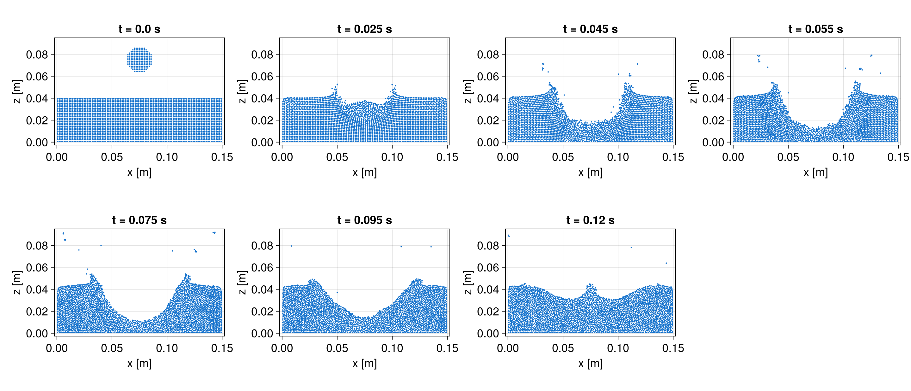
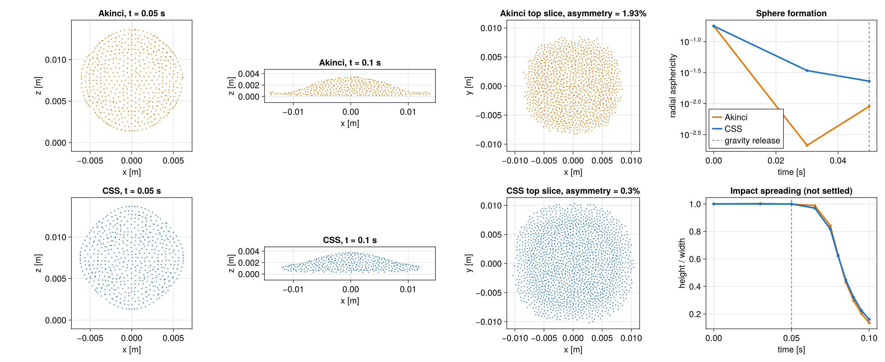
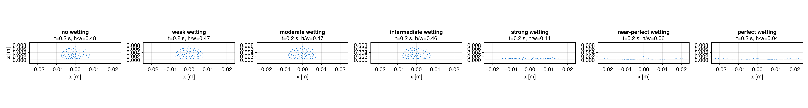
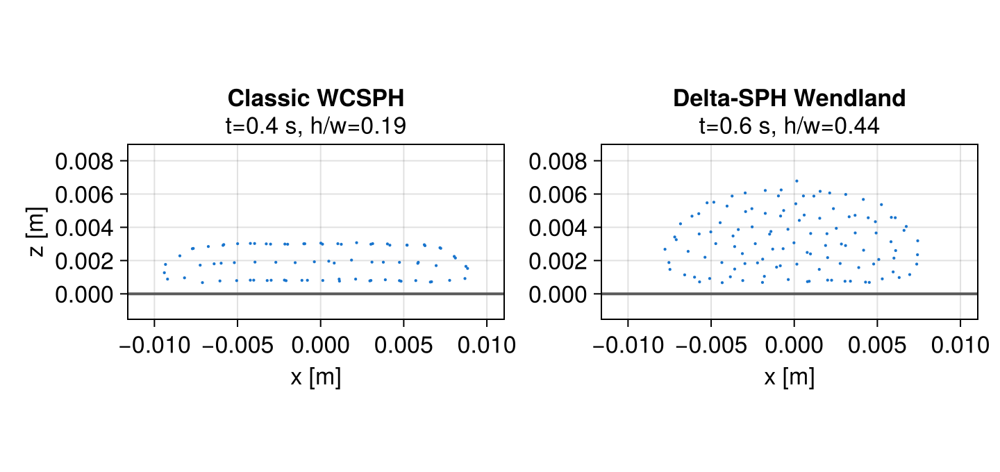
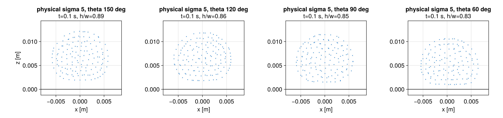
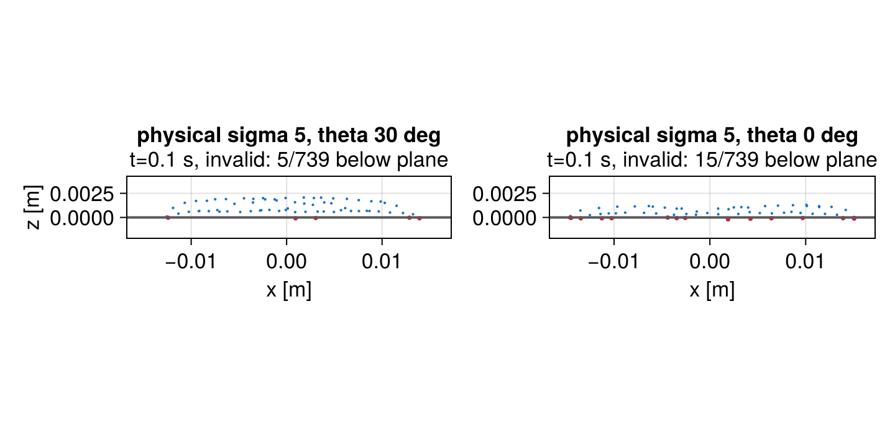
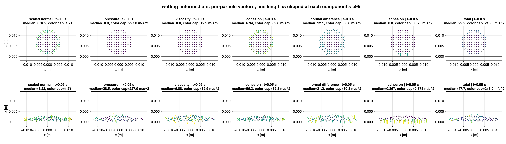
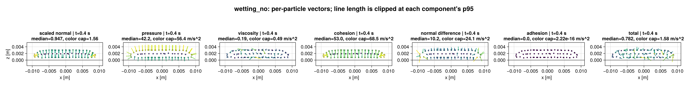

# Akinci Comparison Workbench

This directory validates the Akinci experiments in `examples/fluid` against Akinci, Akinci, and
Teschner (2013),
<https://doi.org/10.1145/2508363.2508395>.

Simulation accuracy is checked from unsmoothed particle slices before surface reconstruction or
ray tracing. Figure 1 is the first case under this workflow:



The Figure 1 setup now uses the reported `15 x 4 x 15 cm` filled container. At the comparison
resolution of `1.5 mm`, the regular voxel drop is `6.53 cm^3`, 0.5% above the reported `6.5 cm^3`.
The roughly 272,000 fluid particles are still fewer than the paper's one million. The impact speed
is not reported and is calibrated to `2 m/s` for this reduced resolution. The impact, crown,
cavity collapse, and onset of the central rebound are resolved through `0.12 s`; the mature narrow
jet requires a later run and is not yet accepted. Figure 2 has an accepted Akinci baseline and an
alignment-corrected CSS candidate that still fails bulk parity; Figures 6, 7, 9, and 10 remain
pending, and the Figure 8 Akinci failure is described below.

The Akinci normal uses the kernel's compact-support radius, as defined in Equation 2 of the paper.
The case uses summation density so the free-surface correction in Equation 4 responds to missing
neighbors, and uses the same Monaghan artificial viscosity for fluid-fluid and fluid-solid pairs.

A spacing study confirmed that the previous `2.5 mm` case preserved the bulk displaced volume but
filtered the thin crown and detached droplets. At `t = 0.055 s`, the center-slice spray heights are
`0.0496 m`, `0.0829 m`, and `0.0792 m` for `2.5 mm`, `2.0 mm`, and `1.5 mm`, respectively. The
`2.0 mm` and `1.5 mm` crown-rim heights agree within 1.3%. The paper's reported particle count
corresponds to approximately `0.97 mm` spacing.

## Track B CSS Calibration

Track B coefficients are calibrated demonstration parameters, not physical material properties.
Every accepted row must first match its Akinci metric at the comparison resolution, then preserve
the qualitative result under `+/-20%` sigma and at a second resolution. The common CSS configuration
uses `SurfaceTensionMomentumMorris`, `WendlandC2Kernel{3}` with `h/dx = 1.4`,
`ContinuityDensity`, `DensityDiffusionAntuono(delta=0.1)`, and the validated surface-activity
thresholds. Free-surface cases can explicitly use consistent Sun-2019 shifting with
`FreeSurfaceTangentialShifting`; wetting contact, when used, is always explicit.

The calibration table is intentionally incomplete while Phase 4 is in progress. A `pending` entry
is not an accepted default.

| Case | Calibrated sigma | Contact angle | Calibration metric / status |
|:-----|-----------------:|:--------------|:----------------------------|
| Figures 1/5, water crown | pending | none | Crown-rim height at `0.055 s`; accepted Akinci mature-jet row still needed |
| Figure 2, cube-to-sphere | not accepted (`0.012 N/m` candidate) | none | Alignment and reliability pass; strict sphere/spread parity fails |
| Figure 6, plate impact | pending | pending | Spread/rebound diameter history |
| Figure 7, stream over sphere | pending | unsupported on the current closed curved patch | Attached-film/detachment behavior |
| Figure 8, wetting ladder | start at `5 N/m` | pending | Monotone `h/w` ladder and zero penetration |
| Figure 9, splitting | not assigned | out of current CSS scope (D4) | Requires adhesive box/non-adhesive blade contrast |
| Figure 10, rolling | not assigned | out of current CSS scope (D4) | Requires distinct plane/rigid-body wettability |

The published Figure 8 coefficient pairs cannot be silently relabeled as a monotone contact-angle
ladder. Applying the derived Young-Dupre estimate gives approximately
`180, 171.6, 168.1, 161.1, 168.1, 168.1, 180 degrees`; the sequence is non-monotone and its exact
`180-degree` endpoints are outside the production contact model's open interval. The Track B angle
policy therefore remains unresolved rather than substituting visual labels for that mapping.

### Figure 2 CSS status

The paper caption and companion video require two distinct states: a cube first forms a sphere above
the floor, then the released sphere spreads into a thin symmetric layer. The former `0.085 s`,
non-adhesive workbench endpoint stopped during early impact and was not a valid Figure 2 baseline.
The corrected Akinci case follows the paper's unstated-solid default `beta = gamma = 1` and saves the
thin layer at `0.10 s`; its final `h/w` is `0.1354` and its x/y spread asymmetry is `1.95%`.

The `0.10 s` panel is a transient comparison frame, not a settled wetting state. At that time the
Akinci/alignment-corrected CSS RMS speeds are still `0.259/0.185 m/s` and both widths are increasing. The paper caption
only says the sphere is dropped, and the companion clip keeps changing the pancake before cutting to
the next experiment; it does not identify an equilibrium frame. The current 30 mm floor is already
almost filled by the 28.5 mm layer, so a true settled-state study would require a larger domain and a
separate long-time acceptance target instead of silently extending this run.

`cube_to_sphere_css` reuses that corrected 6859-particle geometry and timing. Its viscosity remains
fixed at `alpha = 0.05`; lowering it to the example's `0.01` with shifting gives a distorted
3375-particle sphere and density as low as `570 kg/m^3`. `Sigma = 0.012 N/m` remains the best
calibration candidate. The runner now explicitly uses `ConsistentShiftingSun2019` with
`sound_speed_factor = 0.1` and `FreeSurfaceTangentialShifting()`.

This treatment was added after the original nominal row was found to retain coherent particle rays
along the coordinate axes and 45-degree directions. The unshifted full-resolution row had angular
bin CV/eightfold/radial-neighbor alignment `0.231/0.0388/0.256`, compared with
`0.134/0.00513/0.0218` for Akinci. Free-surface-aware shifting retains full consistent shifting in
the interior and progressively removes its interface-normal component, leaving tangential shifting
at the represented surface. The corrected full-resolution values are
`0.108/0.00255/0.0472`, and the raw top slice no longer contains coherent axis or diagonal rays.

The pre-release metric compares the second and fourth radial moments with those of an equal-volume
sphere. Impact acceptance additionally requires a final thin layer (`h/w <= 0.2`), x/y asymmetry at
most `5%`, maximum post-release width error at most `10%`, final aspect-ratio error at most `0.05`,
and height agreement within two CSS particle spacings. Reliability requires at most 25% rejected
steps, timestep tail/head ratio at least `0.5`, density in `900-1020 kg/m^3`, and no particle below
the floor. Particle isotropy additionally compares angular-bin variation, eightfold angular order,
and nearest-neighbor orientation relative to the radial direction. Perturbation and
coarse-resolution rows use relaxed qualitative limits of `h/w <= 0.25`, 10% asymmetry, 20% width
error, and correspondingly relaxed isotropy bounds.

| Run | Release asphericity | Final `h/w` | Max. width error | Alignment CV / m8 / radial | Density range | Accepted / rejected | Timestep tail/head | Required gate |
|:----|---------------------:|------------:|-----------------:|:---------------------------|:--------------|--------------------:|-------------------:|:--------------|
| Akinci baseline | `0.00902` | `0.1354` | - | `0.134 / 0.005 / 0.022` | diagnostic only | `11459 / 54` | not recorded | accepted baseline |
| Shifted CSS, `sigma = 0.012`, `dx = 0.526 mm` | `0.02295` | `0.1608` | `13.53%` | `0.108 / 0.003 / 0.047` | `978.33-1000.38` | `2253 / 109` | `0.983` | **fail bulk parity** |
| Shifted CSS, `sigma = 0.012`, `dx = 0.667 mm` | `0.02106` | `0.1665` | `14.19%` | `0.161 / 0.007 / 0.050` | `955.58-1000.40` | `1751 / 167` | `1.152` | pass qualitative |

The full-resolution candidate passes alignment, symmetry, height, density, wall-clearance,
rejection, and timestep gates. It remains unaccepted because its maximum pre-release asphericity
error is `0.03194` (limit `0.025`), release asphericity is `0.02295` (matched limit `0.01902`), and
maximum post-release width error is `13.53%` (limit `10%`). The `+/-20%` coefficient replays were
not repeated after this nominal failure. CSS does not use a wall contact model in this comparison;
the Akinci baseline's paper-default wall adhesion and that model difference remain explicit. Raw
values are in `figure_02_track_b.csv`; the diagnostic below is generated directly from serialized
particle states before surface reconstruction.

A bounded 3375-particle follow-up tested the remaining mechanistic alternatives without replacing
the nominal evidence row:

| Probe | Release asphericity | Final `h/w` | Alignment CV / m8 / radial | Density range | Result |
|:------|---------------------:|------------:|:---------------------------|:--------------|:-------|
| `v_max_factor = 1` | `0.01820` | `0.1874` | `0.303 / 0.068 / 0.296` | `988.34-1000.25` | release improves, but all qualitative isotropy gates fail |
| `v_max_factor = 15` | `0.02142` | `0.1667` | `0.138 / 0.003 / 0.069` | `905.28-1000.50` | impact isotropy returns, but bulk shape does not improve |
| `sigma = 0.0144 N/m` | `0.02263` | `0.1682` | `0.111 / 0.010 / 0.084` | `965.13-1000.33` | stronger capillarity worsens release and final shape |
| `alpha = 0.025` | `0.03201` | `0.1522` | `0.171 / 0.005 / 0.083` | `947.70-1000.41` | spreading improves, but the release-shape gate fails |

The factor-15 probe matches the existing `4 m/s` shifting scale near impact while retaining weaker
shifting during pre-release relaxation. Its failure closes the adaptive-scaling branch rather than
motivating a factor sweep. None of these probes merits a full-resolution replay; Figure 2 remains an
explicit CSS bulk-parity failure and parameter tuning stops here.

The remaining Tier 1 hydrodynamic choices were tested independently on the same unshifted
3375-particle lattice. Plain Antuono diffusion is stabilizing rather than the source of the lattice
imprint: restricting it to well-supported particles or disabling it collapses the final minimum
density without materially improving shape or radial alignment.

| Density diffusion | Final `h/w` | Final radial alignment | Final minimum density |
|:------------------|------------:|-----------------------:|----------------------:|
| Antuono, `delta = 0.1` | `0.1865` | `0.408` | `987.36 kg/m^3` |
| Free-surface support gated | `0.1858` | `0.459` | `780.12 kg/m^3` |
| None | `0.1831` | `0.417` | `685.63 kg/m^3` |

Matched-kinematic-viscosity Morris and Adami operators produce effectively identical bulk
trajectories. Both reduce the final width from `24.562 mm` to `22.666 mm` and increase radial
alignment from `0.408` to `0.470`, so the existing Monaghan viscosity is retained. These bounded
ablations close density diffusion and viscosity as explanations for the Figure 2 discrepancy.

A Tier 2 operator probe implemented the free-surface core of the C-CSF method of Vergnaud et al.
using its minimum-moment-eigenvalue normal, renormalized curvature, thin-jet angular gate, and
Shepard-corrected surface delta. This first probe excluded the paper's BIM boundary and contact-angle
terms, so the floor was excluded from C-CSF geometry exactly as it was from the no-contact CSS
control. The later row-5 probe below adds those terms. The following results use identical unshifted
lattice, Antuono, Monaghan, coefficient, and resolution settings:

| Surface operator | Pre-release error | Release asphericity | Final `h/w` | Width error | CV / m8 / radial |
|:-----------------|------------------:|----------------------:|------------:|------------:|:-----------------|
| Existing CSS control | `0.01863` | `0.01139` | `0.1865` | `6.75%` | `0.139 / 0.005 / 0.408` |
| C-CSF free-surface core | `0.00357` | `0.01039` | `0.1977` | `12.34%` | `0.204 / 0.006 / 0.437` |

C-CSF improves the pre-release moments but worsens post-release spread and every reported final
isotropy measure. Both rows pass reliability and fail qualitative radial alignment. This closes the
unshifted C-CSF branch for Figure 2 without a full-resolution replay; the failure is method-level
evidence, not a reason to tune the published operator thresholds.

The stabilization and shifting-schedule probes were completed against the same coarse baseline:

| Probe | Pre-release error | Release asphericity | Final `h/w` | Width error | CV / m8 / radial | Result |
|:------|------------------:|--------------------:|------------:|------------:|:-----------------|:-------|
| Interface TIC, strength `1.0`, unshifted | `0.44004` | - | - | - | - | closed before wall contact: full-strength interior TIC destroys sphere formation; post-contact metrics were invalidated by the runner audit |
| TIC `0.25` + Sun-2017 tangential shifting | `0.02705` | - | - | - | - | closed by the pre-release gate; post-contact metrics were not revalidated |
| Consistent shifting stopped at `0.03 s` | `0.03375` | - | - | - | - | closed by the pre-release gate; post-contact metrics were not revalidated |
| TIC `0.25` + consistent tangential shifting | `0.03913` | `0.02308` | `0.1623` | `9.28%` | `0.124 / 0.007 / 0.059` | qualitative and reliability gates pass; nominal pre-release and radial-alignment gates fail |
| C-CSF + TIC `0.25` + consistent tangential shifting | `0.00847` | `0.00685` | `0.1699` | `12.05%` | `0.139 / 0.001 / 0.048` | formation and release beat the baseline, but width fails and the timestep tail/head collapses to `0.11` |

The base CSS row remains a qualitative pass, but it is not a one-gate near-miss: pre-release error
exceeds `0.025` and final radial alignment exceeds `0.05`. Because the C-CSF operator's one clear
strength is the formation phase (pre-release `0.00357` unshifted), the interface-aware TIC validation
also accepts `CorrectedCSFSurfaceNormal` with `SurfaceTensionMorris`. That combination confirms a
complementarity instead of a resolution: C-CSF fixes formation, but its width error exceeds `10%`
and its timestep tail/head ratio falls to `0.11`.

Four additional method rows were then tested on the TIC `0.25` + consistent-shifting base. All
reported kernel probes use `h/dx = 1.5`, hence support radius `R/dx = 3` and an ideal 3D stencil of
approximately 113 particles. The earlier `1.8-2.0` estimate was incorrect because every tested
Wendland kernel has compact support `2h`.

An implementation audit invalidated the original TIC-based results. The runner passed
`clip_negative_pressure=false` for the fluid equation of state, as required by TIC, but
`trixi_include` also replaced the identically named Adami-wall keyword and silently disabled wall
pressure clipping. The runner now overrides `fluid_clip_negative_pressure` independently, with a
regression test pinning fluid clipping off and boundary clipping on. The audit also corrected the
C-CSF boundary moment orientation and analytical wall-overlap factor, and separated smoothed CSS
stress normals from the raw normals used by particle shifting. The following table contains fresh
runs against a regenerated 3375-particle baseline; all earlier TIC-based numbers are superseded.

| Row | Method | Pre-release error | Release asphericity | Final `h/w` | Width error | Density range | Outcome |
|---:|:-------|------------------:|--------------------:|------------:|------------:|:--------------|:--------|
| 2a | Wendland C4, `h/dx = 1.5` | `0.03140` | `0.02062` | `0.1647` | `9.91%` | `999.41-1000.39` | pre-release and radial alignment (`0.072`) fail; qualitative and reliability gates pass |
| 2b | Wendland C6, `h/dx = 1.5` | `0.03656` | `0.01759` | `0.1669` | `9.92%` | `999.45-1000.41` | every gate except pre-release passes |
| 4 | CSS + neutral `90` degree floor contact | `0.03913` | `0.02308` | `0.1705` | `9.07%` | `999.74-1000.66` | every gate except pre-release passes; contact cannot fix formation |
| 5 | C-CSF geometry BIM + `90` degree contact | `0.00847` | `0.00942` | `0.1856` | `10.12%` | `987.60-1001.85` | width and timestep tail/head (`0.20`) fail; radial alignment passes |
| 6 | One-pass Shepard-smoothed CSS normals | `0.04389` | `0.02110` | `0.1683` | `6.08%` | `998.50-1000.73` | every gate except pre-release passes; smoothing improves spread and radial alignment |

Rows 2, 4, 5, and 6 are closed without full-resolution replay. C6, neutral contact, and normal
smoothing are each reliable one-gate near-misses, with C6 giving the smallest pre-release miss.
The row-5 implementation contains the paper's planar boundary terms for C-CSF geometry but retains
Adami dummy-particle continuity and momentum coupling; it is not the paper's complete hydrodynamic
BIM formulation. Its corrected result therefore closes this mixed configuration, not full BIM.

A final staged probe combined the complementary rows: free-surface C-CSF forms the drop, then
one-pass Shepard-smoothed CSS handles impact. Switching at release passes every coarse gate, but its
reference-resolution replay under-spreads by `11.17%`, just outside the `10%` width gate. Delaying
the switch to impact onset (`t = 0.065 s`, when the lowest particle center is approximately `0.86 dx`
above the floor at both resolutions) reduces that width miss but degrades radial alignment. Both
variants remain reliable and pass the qualitative gates:

| Switch | Particles | Pre-release error | Release asphericity | Final `h/w` | Width error | Final radial alignment | Timestep tail/head | Outcome |
|:-------|----------:|------------------:|--------------------:|------------:|------------:|-----------------------:|-------------------:|:--------|
| Release, `0.050 s` | 3375 | `0.00847` | `0.00685` | `0.1776` | `9.16%` | `0.0476` | `2.85` | all nominal gates pass |
| Release, `0.050 s` | 6859 | `0.01033` | `0.01195` | `0.1841` | `11.17%` | `0.0461` | `2.13` | width fails |
| Impact onset, `0.065 s` | 3375 | `0.00847` | `0.00685` | `0.1783` | `6.05%` | `0.0512` | `2.90` | radial alignment fails |
| Impact onset, `0.065 s` | 6859 | `0.01033` | `0.01195` | `0.1838` | `10.34%` | `0.1198` | `2.00` | width and radial alignment fail |

The signed release-switch width error changes from `+9.59%` at `0.075 s` to `-11.17%` at
`0.100 s` at reference resolution, so the evidence does not support a uniform increase or decrease
in spreading force.
An exploratory unsaved-time switch at `0.060 s` also failed qualitatively rather than interpolating
between the saved-time results. The phase-switch branch is therefore closed without further timing
or coefficient fitting.

#### Figure 2 open-method ledger

Ticking-off protocol: one row at a time against the frozen gates, identical 3375-particle coarse
A/B versus the regenerated Akinci baseline, one mechanism change per row, no coefficient sweeps.
A row is closed by a failed comparison or an explicit scope decision; a row is promoted to a
full-resolution replay only if the coarse comparison passes the nominal gates or isolates a clear
mechanistic improvement.

| # | Candidate | Targets | Availability | Status |
|--:|:----------|:--------|:-------------|:-------|
| 1 | C-CSF geometry + TIC `0.25` + consistent tangential shifting | pre-release gate of the near-miss row | configuration (TIC validation extended) | closed: fixes formation (`0.00847`) but fails width (`12.05%`) and timestep tail/head (`0.11`) |
| 2 | Larger kernel support (`WendlandC4/C6`, `h/dx = 1.5`, approximately 113 neighbors) | pre-release curvature accuracy, lattice imprint | runner supports C2/C4/C6 and explicit `h/dx` | closed: C4 reaches `0.03140` but also fails radial alignment; C6 reaches `0.03656` and otherwise passes |
| 3 | EDAC pressure evolution instead of the Cole EOS | formation-phase pressure noise | small runner/example change | open |
| 4 | Explicit floor contact for CSS (`WettedAreaContactAngle`, neutral `90` degrees) | post-release spread parity versus the baseline's default wall adhesion | configuration (`contact_angle` knob) | closed: every gate except unchanged pre-release (`0.03913`) passes |
| 5 | C-CSF boundary-integral floor geometry (`lambda_j = 1` faces, contact-angle correction) | operator consistency near the floor | planar geometry BIM with boundary quadrature; Adami hydrodynamics retained | closed for the mixed formulation: width `10.12%` and timestep tail/head `0.20` fail |
| 6 | Shepard-smoothed normals before the CSS stress divergence | width/isotropy noise | one-pass activity-weighted Shepard option | closed: every gate except pre-release (`0.04389`) passes; no integration failure after the runner fix |
| 7 | Reproducing-divergence CSF (Adami et al. 2010) | curvature-free alternative stress | new implementation, moderate | open |
| 8 | Momentum-consistent ALE shifting (Oger et al. 2016) | shape parity under shifting | new implementation, large | open |
| 9 | Riemann-based WCSPH scheme (Parshikov; the C-CSF paper's scheme) | pressure-field regularity | new implementation, large | deferred |
| 10 | Physical pairwise-force cohesion (`SurfaceTensionAkinciCohesionPhysical`) as the CSS replacement | bulk shape via pairwise forces | configuration | low priority: Akinci-family model with published interface-pressure artifacts |
| 11 | C-CSF formation followed by smoothed-CSS impact | combine the formation and spreading strengths of rows 1 and 6 | staged runner | closed: release switch passes coarse but misses reference width (`11.17%`); impact-onset switch misses reference width (`10.34%`) and radial alignment (`0.120`) |
| - | Shifting-scale, `sigma`, and `alpha` parameter probes | - | - | closed, table above |
| - | Jittered/packed initial conditions; Sun-2017 shifting with jitter | lattice imprint | - | closed, resolution-dependent or asymmetric |
| - | Density-diffusion gating or removal | lattice imprint, density floor | - | closed, diffusion is stabilizing |
| - | Morris/Adami viscosity operators | spreading, isotropy | - | closed, no material change |
| - | C-CSF free-surface core, unshifted | pre-release shape | - | closed, spread and isotropy regress |
| - | Interior TIC at full strength; TIC with Sun-2017 shifting; staged shifting stop | stability schedule | - | closed, table above |



Reproduce the nominal rows and evidence with:

```bash
JULIA_NUM_THREADS=8 julia +release --project=compare_akinci/simulation \
    compare_akinci/simulate.jl cube_to_sphere /tmp/cube_akinci.jls
JULIA_NUM_THREADS=8 julia +release --project=compare_akinci/simulation \
    compare_akinci/simulate.jl cube_to_sphere_css /tmp/cube_css.jls
JULIA_NUM_THREADS=8 julia +release --project=compare_akinci/simulation \
    compare_akinci/figure_02_metrics.jl compare /tmp/cube_akinci.jls \
    compare_akinci/figure_02_track_b.csv /tmp/cube_css.jls
JULIA_NUM_THREADS=8 julia +release --project=compare_akinci/simulation \
    compare_akinci/figure_02_surface_switch.jl /tmp/cube_surface_switch.jls \
    0.0006666666666666666 0.05
JULIA_NUM_THREADS=8 julia +release --project=compare_akinci \
    compare_akinci/figure_02_diagnostics.jl /tmp/cube_akinci.jls /tmp/cube_css.jls \
    compare_akinci/figure_02_css_akinci_diagnostic.png
```

### D4: heterogeneous wall adhesion

Figures 9 and 10 are outside the current CSS contact scope. `WettedAreaContactAngle` stores one
contact angle on the fluid, applies it to every admitted boundary, and accepts only explicit,
connected disk-like surface patches. It cannot represent the adhesive-box/non-adhesive-blade split
in Figure 9 or the distinct plane and rigid-figure wettability in Figure 10. Pairing CSS with
`SurfaceTensionAkinciCohesionPhysical` would require an unimplemented composite surface model and
would no longer be a CSS-only comparison. D4 therefore records an explicit unsupported-mechanism
cause instead of adding a misleading runner or expanding the production API during Track B.

## Figure 8 Investigation

The companion video shows one continuously evolving droplet with coefficient sequence
`(gamma, beta) = (1, 0), (1, 0.05), (1, 0.1), (1, 0.25), (0.1, 0.01), (0.01, 0.001),
(0.001, 0)`. It does not report the physical duration of each stage. Independent simulations at an
arbitrary common final time therefore are diagnostics, not accepted reproductions of its panels.

The per-particle analysis verifies the implemented Akinci forces independently of the production
right-hand side. Reconstructed density and normals agree to roundoff, and the decomposed pressure,
viscosity, cohesion, curvature, adhesion, and gravity terms reproduce the production acceleration
to about `1e-12 m/s^2`. A zero-gravity no-wetting sphere also retains its shape. Adding wall normals,
increasing sound speed, pre-relaxing the sphere, aligning its contact point, and replacing Adami
pressure extrapolation with pressure mirroring do not prevent the gravity-driven collapse.

The normal formula and support-radius scaling match Equation 2 and the current SPlisHSPlasH
implementation. Both references sum fluid neighbors only, so the Akinci default now disables the
optional wall-normal augmentation. On the initial 739-particle voxel sphere, the 21 wall-contact
normals have a median radial-direction error of `18.8 degrees`; adding wall normals increases it to
`21.2 degrees`. Current-density volume weights also produce small outward normals one layer inside
the free surface because low-density surface neighbors are over-weighted. A diagnostic reconstruction
with initial-density volume weights removes these reversed interior normals and lowers the
contact-normal error to `13.0 degrees`, but a trial using those weights only changes the
no-wetting result at
`t = 0.05 s` from `h/w = 0.162` to `h/w = 0.167`. The alternative is not retained as a production
method because it does not materially improve the result and differs from the published formula.
The normal defect is therefore measurable but is not the primary cause of the collapse.

Kernel correction and normal smoothing were also tested. Applying the normalized
`KernelCorrection` gradient directly is not valid for this model: by construction it enforces
`sum(V_b * grad(W_corrected_ab)) = 0`, which would erase the constant-color free-surface signal.
A first-order moment correction improves the initial median surface-normal error only from
`17.5 degrees` to `15.3 degrees`, doubles its median magnitude from `1.27` to `2.41`, and leaves
the reversed interior directions unchanged. A full WCSPH run with `GradientCorrection()` gives
`h/w = 0.160` at `t = 0.05 s`, indistinguishable from the `0.162` baseline.

One-pass Shepard smoothing with the original normal magnitude restored improves the static
surface and wall-contact direction errors to `8.8 degrees` and `9.7 degrees`, respectively.
Despite the cleaner field, the no-wetting simulation becomes slightly flatter (`h/w = 0.151` at
`t = 0.05 s`). Neither correction nor smoothing is retained as a production method; their exact
offline reconstructions remain in `force_analysis.jl`.

Increasing cubic-spline support from the reported `2 delta_x` to `2.4 delta_x` reduces the static
surface/contact direction errors to `11.5 degrees`/`10.5 degrees`, but only improves the dynamic
shape to `h/w = 0.187` at `t = 0.05 s`. A `3 delta_x` support improves the static directions further
while increasing spurious interior-normal magnitude; both supports change the published model.
Switching to a Wendland C2 kernel at the same `2 delta_x` support does not improve angular error and
changes the discrete rest-density normalization substantially. The reported cubic kernel and support
are therefore retained.

The failure originates in the WCSPH wall-contact response. Initially, only 21 of 739 fluid particles
have wall neighbors, and their particle-summed upward boundary-pressure acceleration is about
`10 m/s^2`, compared with about `7250 m/s^2` of particle-summed weight. The droplet consequently
spreads until 303 particles contact the wall. At `t = 0.6 s`, the no-wetting case has settled to
`19.619 x 3.660 mm` (`h/w = 0.1866`), and its mean upward boundary-pressure acceleration is
`9.735 m/s^2`, approximately balancing gravity. Pressure mirroring settles to an even wider
`50.605 x 5.007 mm` state and permits wall penetration.

Scalar pressure support alone does not fix the contact response. An Adami pressure offset of about
`9.6 kPa` balances the initial particle-summed weight, but the no-wetting droplet still reaches
`h/w = 0.163` at `t = 0.05 s`. Increasing the Monaghan artificial-viscosity coefficient from `0.01`
to `1.0` damps the contact transient and gives `h/w = 0.627` at `t = 0.05 s`, but the state continues
to flatten to `h/w = 0.410` at `t = 0.2 s`. Combining the pressure offset with this damping is worse
(`h/w = 0.362` at `t = 0.2 s`).

Akinci boundary volumes and Adami extensions were investigated in six controlled steps. Number-density
volume correction multiplies the exposed mass by `1.176` for the three-layer plate and by `1.427` for
a single-layer plate. With three layers, it raises initial particle-summed wall support from
`10.1 m/s^2` to `11.9 m/s^2` and contact-particle median support from `0.471 m/s^2` to
`0.554 m/s^2`. The correction is internally consistent but remains far below the particle-summed
weight of about `7250 m/s^2`.

The corrected three-layer result reaches `h/w = 0.1647` at `t = 0.05 s` and `0.1262` at
`t = 0.2 s`, compared with `0.1616` and `0.1195` for uniform masses. A corrected single-layer plate
gives `0.1578` and `0.1246`, so layer count is not the missing mechanism. Adding the spherical
Laplace pressure (`322 Pa`) as an Adami pressure offset gives `h/w = 0.1643` at `t = 0.05 s`.

A kernel-weighted affine pressure reconstruction was also prototyped. Weak regularization delays
spreading to `h/w = 0.586` at `t = 0.025 s`, but becomes unstable and ejects particles by
`t = 0.05 s`. Strong regularization is stable but returns to `h/w = 0.1602`, while being much more
expensive than zeroth-order Adami. The experimental implementation was removed. Standard Adami with
three corrected boundary layers remains the best tested dummy-particle boundary, but the improvement
is too small to accept Figure 8. Repulsive Monaghan-Kajtar boundaries and a switch to an
incompressible solver are not planned.

The fixed-particle WCSPH pressure operator was then assembled explicitly, including the linearized
Adami dependence of every boundary pressure on neighboring fluid pressures. A nonnegative
least-squares solve reduces acceleration-magnitude RMS from `42.30` to `10.51 m/s^2` with summation
density, but leaves mean vertical acceleration at `-9.685 m/s^2`. With continuity density, the
corresponding values are `43.50`, `10.30`, and `-9.634 m/s^2`. The unconstrained solutions are already
entirely positive and give the same residual, so pressure initialization cannot produce a static
compact state with the current wall-force quadrature.

An mDBC-style pressure prototype moved the pressure reconstruction point from the exposed boundary
layer to its reflection inside the fluid support. It changes the continuity-density mean vertical
residual only from `-9.63413` to `-9.63399 m/s^2`. Reflected pressure interpolation therefore does not
address the limiting geometry: pressure reaction is still applied through the same small set of
fluid-boundary pairs. A dynamic pressure-initialization run was intentionally skipped because the
discrete operator has no corresponding static equilibrium.

Replacing the discrete dummy-particle pressure sum by an exact planar half-space integral of the
cubic kernel also fails the equilibrium gate. With summation density it changes residual RMS from
`10.507` to `10.440 m/s^2` and mean vertical residual from `-9.685` to `-9.566 m/s^2`. With continuity
density the corresponding changes are `10.301` to `10.243 m/s^2` and `-9.634` to
`-9.466 m/s^2`. This modest improvement does not justify a dynamic semi-analytical implementation.

Finally, the inter-particle averaged pressure acceleration used by Adami et al. (2012) was tested
with standard Adami extrapolation and corrected boundary volumes. It gives `h/w = 0.1625` at
`t = 0.05 s`, compared with `0.1647` for the default summation-density pressure operator. Thus the
remaining failure is not the choice between the two available pressure-force formulas.

A sparse continuity-density/semi-analytical operator study then increased fluid resolution by a
factor of eight:

| Target particles | Actual particles | Wall-supported particles | Residual RMS | Mean vertical residual |
|-----------------:|-----------------:|-------------------------:|-------------:|-----------------------:|
| 750 | 739 | 21 | `10.2428 m/s^2` | `-9.4665 m/s^2` |
| 3000 | 2969 | 49 | `10.1978 m/s^2` | `-9.7728 m/s^2` |
| 6000 | 6031 | 110 | `10.1877 m/s^2` | `-9.6979 m/s^2` |

The residual plateaus near gravity even though wall support covers over five times as many
particles. None reaches the `1 m/s^2` dynamic-run gate, so no high-resolution integration was
started. Coarse contact sampling is not the primary failure over this range.

## Modern WCSPH Variants

Continuity-density and delta-SPH variants improve density quality but remain flat with the reported
cubic kernel. At `t = 0.05 s`, continuity density gives `h/w = 0.1844` while its free-surface density
falls to `655 kg/m^3`. Molteni-Colagrossi, Ferrari, and Antuono diffusion give `0.1793`, `0.1825`, and
`0.1827`, respectively, while keeping density close to `1000 kg/m^3`.

Using Antuono diffusion with a larger-support Wendland kernel is substantially better:

| Kernel and WCSPH settings | `h/w` at `0.05 s` |
|---------------------------|-------------------:|
| Wendland C2, `h = 1.3 delta_x`, `c0 = 30 m/s` | 0.2071 |
| Wendland C2, `h = 1.4 delta_x`, `c0 = 30 m/s` | 0.2314 |
| Wendland C4, `h = 1.3 delta_x`, `c0 = 30 m/s` | 0.2003 |
| Wendland C2, `h = 1.3 delta_x`, `c0 = 100 m/s` | 0.2295 |
| Wendland C2, `h = 1.4 delta_x`, `c0 = 100 m/s` | 0.2592 |

The best combination uses continuity density, Antuono diffusion with `delta = 0.1`, Wendland C2 with
`h = 1.4 delta_x`, `c0 = 100 m/s`, corrected boundary volumes, and standard Adami extrapolation. It
rebounds after its initial compression and settles by `t = 0.6 s` to `16.305 x 7.233 mm`,
`h/w = 0.4436`, with RMS speed `0.0015 m/s` and density in `1000.00-1000.01 kg/m^3`. This is a genuine
compact WCSPH equilibrium, but the companion video's no-wetting droplet remains much closer to a
sphere.

A diffusion-strength sweep confirms that diffusion is required but is not the cause of the compact
state:

| Antuono `delta` | `h/w` at `0.2 s` | Minimum density at `0.2 s` |
|----------------:|-----------------:|---------------------------:|
| none | 0.4432 | `890.23 kg/m^3` |
| 0.01 | 0.4700 | `999.99 kg/m^3` |
| 0.03 | 0.4607 | `999.98 kg/m^3` |
| 0.05 | 0.4569 | `1000.00 kg/m^3` |
| 0.1 | 0.4752 | `1000.00 kg/m^3` |

The apparent differences at `0.2 s` are transient. At `0.6 s`, `delta = 0.01` and `0.1` converge to
`h/w = 0.4449` and `0.4436`, respectively. The larger diffusion coefficient is retained for the full
wetting sequence because it better controls density when low surface tension stretches the drop into
a thin film.

Three free-surface and Akinci-specific modifications were rejected. Tapering Antuono diffusion to
zero as the kernel-summation density falls from `0.9 rho_0` to `0.6 rho_0` lowers `h/w` from `0.4700`
to `0.4415`. Using the paper's cubic `2 delta_x` support for Akinci normals, cohesion, and adhesion
while retaining the `2.8 delta_x` Wendland WCSPH support lowers it to `0.1748`; combining both changes
gives `0.1797`. The planar dimensionless normal is `1.4` for the cubic kernel and `1.5` for Wendland
C2, so the non-fitted curvature correction is `14/15`. It also worsens the result to `0.4586`.
Sensitivity factors of `0.5` and `1.5` give `0.3381` and `0.4818`, showing that an arbitrary curvature
retuning cannot explain the missing near-spherical state.

All seven companion-video coefficient pairs were then run independently to `0.2 s` with the selected
WCSPH configuration:

| Regime | `gamma` | `beta` | Width | Height | `h/w` | Minimum / median density |
|:-------|--------:|-------:|------:|-------:|------:|-------------------------:|
| No wetting | 1 | 0 | `16.091 mm` | `7.646 mm` | 0.4752 | `1000.0 / 1000.0` |
| Weak wetting | 1 | 0.05 | `16.196 mm` | `7.605 mm` | 0.4696 | `1000.0 / 1000.0` |
| Moderate wetting | 1 | 0.1 | `16.247 mm` | `7.561 mm` | 0.4654 | `1000.0 / 1000.0` |
| Intermediate wetting | 1 | 0.25 | `16.297 mm` | `7.479 mm` | 0.4589 | `1000.0 / 1000.0` |
| Strong wetting | 0.1 | 0.01 | `31.627 mm` | `3.555 mm` | 0.1124 | `1000.0 / 1000.0` |
| Near-perfect wetting | 0.01 | 0.001 | `42.592 mm` | `2.715 mm` | 0.0637 | `697.9 / 969.4` |
| Perfect wetting | 0.001 | 0 | `45.236 mm` | `1.821 mm` | 0.0402 | `669.9 / 942.4` |

No fluid particle crosses the wall in any of these runs. The ordering is monotone apart from small
transient variations, but the first four regimes differ by only 3.4% in `h/w`, and the no-wetting
state is still too flat. The final two films are only about one particle layer thick, so their low
density is an under-resolution limit that additional density diffusion cannot remove. These are
therefore useful WCSPH diagnostics, not accepted Figure 8 reproductions.





## Akinci Modification Study

The continuum work integrals clarify why the published coefficients provide little separation
between the first four regimes. For compact-support radius `H`, the three-dimensional cohesion
kernel satisfies

```text
integral(r^4 C(r, H), r=0..H) = 21 H^2 / (880 pi),
sigma_coh = (21 / 7040) gamma rho_0^2 H^2.
```

The corresponding planar work integral of the published adhesion kernel is only
`I_A / I_C = 0.107437`. If both forces were the only sources of interfacial energy, the
Young-Dupre estimate would be `cos(theta) = 2 (beta/gamma) I_A/I_C - 1`. The paper's first four
ratios then correspond to `180.0`, `171.6`, `168.1`, and `161.1 degrees`, rather than a sequence
spanning no wetting to `90 degrees`. With these distinct kernels, even a cohesion-only
`90-degree` state would require `beta/gamma = 4.654`.

These continuum expressions do not directly calibrate the 739-particle discretization. At the
selected `H = 2.8 delta_x`, the virial predicts `0.02833 N/m` for cohesion coefficient one. A
three-radius zero-gravity fit to `delta p = p_bulk + 2 sigma/R` instead measures:

| Model and nominal coefficient | Fitted `sigma` | Bulk prestress | Fit RMS |
|:------------------------------|---------------:|---------------:|--------:|
| Full Akinci, `gamma = 1` | `0.19048 N/m` | `53.58 Pa` | `2.81 Pa` |
| Cohesion only, `gamma = 1` | `0.01669 N/m` | `74.21 Pa` | `0.37 Pa` |
| Distributed Morris, nominal `sigma = 1` | `0.00119 N/m` | `0.35 Pa` | `0.01 Pa` |
| Corrected Morris CSF, `sigma = 1 N/m` | `1.27036 N/m` | `-48.79 Pa` | `0.76 Pa` |
| CSS, `sigma = 1 N/m` | `1.49708 N/m` | `-132.25 Pa` | `0.20 Pa` |

Thus the normal-difference term supplies about 91% of the measured full-Akinci tension in this
configuration. The cohesion virial overpredicts the discrete cohesion result by 70%, and a single
drop's pressure jump cannot be used because it includes substantial lattice bulk prestress. Before
the Phase 1 correction, production Morris could not finish this radius-series gate in five minutes:
its dimensionally incomplete local force was repeated once per fluid neighbor and discontinuous
curvature masks drove the adaptive time step toward zero. Corrected Morris now evaluates
`-sigma kappa delta_s n/rho` once per particle and finishes the three radii in 137 s; CSS finishes
in 119 s. Both dynamic slopes still overpredict the static coefficient and remain Phase 2
convergence targets, not calibration guarantees.

An instantaneous volume-preserving ellipsoid probe independently checks linear response and
conservation, but is not used as the physical calibration because the initial lattice is not a
prestressed spherical equilibrium. The previously recorded production-Morris value (`0.114640`
per nominal coefficient) used the invalid neighbor-repeated force and is retained only as a
historical baseline. The large difference between transient stiffness and radius-series slopes is
another reason to require the Phase 2 convergence tests before recommending a model.

Direct full-Akinci scaling is effective for the video target:

| `gamma` | `h/w` at `0.05 s` | `h/w` at `0.2 s` | Steps to `0.2 s` | Status |
|--------:|--------------------:|-------------------:|-------------------:|:-------|
| `2.6` | 0.4788 | not run | - | insufficient |
| `5.3` | 0.7451 | 0.7533 | 10,421 | stable, no penetration |
| `8.8` | 0.8837 | 0.8191 | 21,605 | closest video match, no penetration |

At `0.2 s`, the `gamma = 5.3` and `8.8` density ranges are `1000.01-1000.07` and
`1000.02-1000.12 kg/m^3`, with RMS speeds `0.0070` and `0.0051 m/s`. The higher coefficient is
expensive: its accepted time step falls to about `3.5e-6 s`. It must therefore receive an explicit
surface-force time-step bound before promotion to a fixed-step workflow.

The other modifications do not improve on this result. At a matched transient restoring stiffness
and `t = 0.02 s`, continuum-normalized cohesion, production Morris, and distributed Morris give
`h/w = 0.7581`, `0.8416`, and `0.8292`, but have RMS speeds `0.1437-0.1629 m/s` and Morris time-step
spikes down to `1e-8 s`. Momentum Morris spreads to `42.1 mm`, sends 31 particles through the wall,
and lowers density to `356 kg/m^3`.

Replacing adhesion by the cohesion kernel gives a stable monotone response only at modest wall
coefficients. Preliminary energy-mapped coefficients `0.654`, `2.440`, and `4.881` produce
`h/w = 0.8728`, `0.8620`, and `0.7981` at `0.05 s`, with no penetration. However, the calibrated
normal-difference energy raises the estimated `90-degree` wall coefficient to about `50`. Direct
coefficients `10`, `25`, and `50` give `h/w = 0.8588`, `0.6286`, and `0.5606` at `0.02 s`; the latter
two already send 4 and 48 particles through the plate. Young-Dupre wall attraction is therefore not
compatible with the current dummy-particle pressure support at the required scale.

A tangential-only CSF contact-line prototype avoids penetration. At `0.02 s`, regularized strengths
`0.0168`, `0.1676`, and `0.5 N/m` give `h/w = 0.8132`, `0.8115`, and `0.8270`, compared with the
`0.8119` no-contact-force result. The measured full-scale value `1.676 N/m` requires steps as small
as `1e-7 s`. It is therefore ineffective when regularized and prohibitively stiff at physical scale.

A common `1/H^2` rescaling of both terms in the complete Akinci model improves its high-resolution
behavior but does not make it resolution-independent. With the 739-particle result as reference,
three-radius fits at 739, 1503, approximately 3000, and approximately 6000 particles give
`0.19048`, `0.14718`, `0.12784`, and `0.10053 N/m`, respectively. The normal-difference term has a
large finite-curvature contribution that cannot be corrected by the cohesion kernel's planar
scaling.

The viable alternative is a dimensionally normalized, central-force-only model. For a requested
physical surface tension `sigma`, rest density `rho_0`, and compact-support radius `H`, it evaluates
the original cohesion kernel with

```text
gamma(H) = sigma / ((21 / 7040) rho_0^2 H^2).
```

`SurfaceTensionAkinciCohesionPhysical` implements this conversion in production as an opt-in 3D
model. It needs no surface normals and retains the pair force's exact linear- and angular-momentum
conservation. A wall's existing `adhesion_coefficient` is interpreted as a dimensionless multiplier
of the same cohesion kernel. Young-Dupre gives
`adhesion_coefficient = (1 + cosd(theta)) / 2`, allowing a contact angle to be specified without a
resolution-dependent wall coefficient. The standard capillary stability limit is included in
automatic time-step selection.

An exact lattice-bond energy calculation checks the normalization without pressure or curvature
fitting:

| Target particles | Actual particles | Surface-energy moment |
|-----------------:|-----------------:|----------------------:|
| 375 | 389 | `0.00294859` |
| 750 | 739 | `0.00287728` |
| 1500 | 1503 | `0.00296035` |
| 3000 | 2969 | `0.00292161` |
| 6000 | 6031 | `0.00293720` |
| 12000 | 11981 | `0.00295482` |

The moments span only 2.8% over a 31-fold particle-count range and all lie within 3.6% of the
continuum value `21 / 7040 = 0.00298295`. The exact infinite planar cubic-lattice moment at
`H/delta_x = 2.8` is `0.00264264`; the finite spherical samples converge near the continuum value
as `R/H` increases.

With `sigma = 5 N/m`, the dynamic no-wetting shape is also stable across the practical resolution
range:

| Target / actual particles | `h/w` at `0.05 s` | `h/w` at `0.2 s` | Density at `0.2 s` | RMS speed at `0.2 s` |
|--------------------------:|-------------------:|------------------:|---------------------:|---------------------:|
| 375 / 389 | 0.8303 | 0.8650 | `1001.12-1001.32 kg/m^3` | `0.0141 m/s` |
| 750 / 739 | 0.8884 | 0.8696 | `1001.38-1001.60 kg/m^3` | `0.0085 m/s` |
| 1500 / 1503 | 0.8504 | 0.8410 | `1001.69-1002.00 kg/m^3` | `0.0067 m/s` |

The settled `h/w` spread is 3.4%, and no particle crosses the wall. At 739 particles, the
same-kernel wall model gives a monotone response by `t = 0.1 s`:

| Target angle | Wall ratio | Width | Height | `h/w` | Minimum `z` | Near-wall particles | RMS speed |
|-------------:|-----------:|------:|-------:|------:|------------:|--------------------:|----------:|
| 150 degrees | 0.06699 | `12.740 mm` | `11.339 mm` | 0.8900 | `1.914 mm` | 0 | `0.0142 m/s` |
| 120 degrees | 0.25 | `12.925 mm` | `11.080 mm` | 0.8573 | `1.823 mm` | 0 | `0.0076 m/s` |
| 90 degrees | 0.5 | `12.940 mm` | `11.053 mm` | 0.8542 | `1.520 mm` | 15 | `0.0096 m/s` |
| 60 degrees | 0.75 | `12.968 mm` | `10.729 mm` | 0.8273 | `0.988 mm` | 54 | `0.0193 m/s` |

All four density ranges remain within `1001.25-1001.70 kg/m^3`, and none penetrates the plate.
The angle labels specify the continuum wall-energy target; these short, coarse runs do not yet
constitute measured equilibrium contact-angle validation. Only the 90- and 60-degree cases have
reached the near-wall threshold `z < 1.5 delta_x` by `0.1 s`.



Targets below 60 degrees are not resolved safely with 739 particles. The 30- and 0-degree runs
spread into one- to three-particle-thick films and cross the nominal plate plane:

| Target angle | Wall ratio | Width | Height | `h/w` | Minimum `z` | Particles below plane | RMS speed |
|-------------:|-----------:|------:|-------:|------:|------------:|----------------------:|----------:|
| 30 degrees | 0.93301 | `28.645 mm` | `3.302 mm` | 0.1153 | `-0.092 mm` | 5 | `0.1048 m/s` |
| 0 degrees | 1.0 | `31.762 mm` | `2.794 mm` | 0.0880 | `-0.197 mm` | 15 | `0.0159 m/s` |

These are failure-limit diagnostics, not accepted wetting results. Particles below the plane are
highlighted in red.



The video-matching value `5 N/m` is deliberately nonphysical for water: it is about 69 times the
room-temperature value. These runs also retain `AkinciFreeSurfaceCorrection`, which multiplies the
central pair force by the local symmetric density correction. The input `sigma` is therefore the
continuum normalization of the underlying cohesion potential, not a claim that a coarse corrected
drop has already reproduced that value in an independent Laplace-pressure fit.

### Balanced continuum surface stress

The scientific follow-up replaces Akinci cohesion with the conservative stress divergence in
`SurfaceTensionMomentumMorris`. The corrected implementation preserves the unnormalized
color-gradient magnitude as the surface delta, applies the one-sided free-surface factor, and uses
a symmetric scalar reproducing correction accumulated during the existing normal pass. It stores no
stress tensor and performs no global reduction or additional neighbor traversal.

A static discrete balance compares the CSS acceleration directly with the WCSPH acceleration from
a unit uniform pressure on exactly the same particles. For an input `sigma = 1 N/m`:

| Particles | Pressure-fit `sigma` | Virial `sigma` | Estimated/analytic area | Total force |
|----------:|---------------------:|----------------:|------------------------:|------------:|
| 389 | `1.0333 N/m` | `0.8323 N/m` | 0.8397 | `4.9e-18 N` |
| 739 | `1.0026 N/m` | `0.8876 N/m` | 0.8797 | `1.7e-18 N` |
| 1503 | `0.9970 N/m` | `0.9101 N/m` | 0.9064 | `3.8e-17 N` |
| 2969 | `0.9557 N/m` | `0.9385 N/m` | 0.9253 | `2.6e-17 N` |
| 6031 | `1.0079 N/m` | `0.9599 N/m` | 0.9452 | `2.1e-17 N` |

The pressure-fit value stays within 4.5% across the range, the energy virial converges toward the
requested coefficient, and total capillary force remains at roundoff. A dynamically relaxed coarse
drop still overpredicts the Laplace pressure: the inferred values at 389, 739, and 1503 particles are
`1.50`, `1.36`, and `1.16 N/m`, respectively. This error decreases under refinement and is now a
documented resolution error rather than a coefficient-unit ambiguity.

Two explicit experimental contact-angle models were evaluated without an attractive wall force:
geometric normal rotation and a colorfield-localized tangential contact-line force. Phase 2 tested
target-initialized zero-gravity caps at five
angles, three resolutions, and both mechanisms. All 30 cells passed the 5-degree local-angle,
density, settlement, and penetration gates. Aggregate evidence was close:

| Metric | Geometric | Contact-line force |
|---|---:|---:|
| Local-angle MAE at 750 / 1500 / 3000 particles | `1.246 / 1.229 / 0.748 deg` | `1.327 / 0.948 / 0.838 deg` |
| Maximum error over all cells | `2.862 deg` | `3.175 deg` |
| 90-degree threshold/damping span | `0.154 deg` | `0.135 deg` |
| Median runtime overhead over no contact model | `2.4%` | `17.3%` |

Those runs establish overdamped equilibrium preservation, not restoring behavior. Phase 3 therefore
started caps away from their requested angle at `(target, initial) = (60, 90)`, `(90, 60)`,
`(90, 120)`, and `(120, 90)` degrees and subtracted a matched no-contact control. Geometric rotation
passed the complete restoring gate in one of four cases; CLF passed two of four. Their correctly
directed initial contact-induced accelerations covered two and three cases, respectively. In the CLF
high-angle case, the colorfield normal reported a contact-line angle near 89 degrees for a cap whose
local-circle angle was 118 degrees, so the force was misdirected. Uniformly longer exploratory runs
confirmed that this was not just a 10 ms observation-window artifact.

Neither mechanism was promoted. Both unshipped implementations were removed after the replacement
passed production replay. Their raw evidence and the deterministic scorecard remain under
`validation/surface_tension_3d/contact_angle_*.csv`.

Recovery diagnostics reject the obvious local fixes. Subtracting the dummy-wall gradient produces
up to 58.5-degree angle error, while a gradient-consistent geometric ghost variant still gives only
two of four correct fixed-particle signs. A target-only Young wall-energy force is the leading
fallback and reaches four of four signs with the expected one-phase factor, but the current and
coarea contact-line measures miss physical line length by more than the accepted tolerance and do
not converge uniformly on spherical caps. A ten-kernel planar study derives the coarea factor from
the implemented gradient integral and passes all 50 middle-resolution cases, but only 40 strict
endpoint gates; the production-style divergence form passes 9/50. The planar Wendland C2 factor and
an existing support-moment correction still fail the spherical-cap gate. No production force was
changed. The completed three-way follow-up identifies fluid-wedge restriction and wall-colorfield
gating as the planar-to-cap discrepancy. Compatible normalized colorfield continuation passes all
five middle cap errors but no original endpoint-decrease gate, while the initial wetted-area measure
fails only its small 150-degree disk.

The next recovery first validates an eight-phase cap protocol against exact continuum fields, then
runs all remaining formulations. A kernel-derived flooded-wall reference and canonical wedge edge
correction reduce the wetted-area errors below 5.68% in all five middle cases (the former 150-degree
error becomes 1.99%), pass all endpoint checks, retain four of four total signs, and give exactly
zero force at 90 degrees. This corrected wetted-area energy is the sole candidate admitted to the
dynamic recovery gate. Its complete density derivative passes all nine algebra/static checks with a
worst energy-gradient error of `4.89e-10` and momentum residuals below `4.1e-15`. The sole uniform
`0.02 s` extension passes `4/4` restoring responses; the threshold, timestep, selected 15-cell, and
sensitivity gates pass `5/5`, `2/2`, `15/15`, and `4/4`. The sensitivity span is `0.107 deg`.
Median validation-only runtime overhead is 2.0% in the inherited, exactly disabled 90-degree path,
while an added active 60-degree benchmark records 30.5%.

Production promotion as `WettedAreaContactAngle(theta)` reproduces the complete replay through only
production caches and RHS paths. Static algebra passes `9/9` with maximum gradient error
`3.59e-10`; extended perturbation, threshold, timestep, selected, and sensitivity gates pass
`4/4`, `5/5`, `2/2`, `15/15`, and `4/4`. Fusing both force terms and accumulating fixed-wall
reactions thread-locally yields 16.0% active 60-degree median overhead, below the pre-registered
20% gate; the exactly disabled 90-degree path has 0.4% overhead. `ColorfieldSurfaceNormal()` still
defaults to no contact model. Final validation, unit/Aqua, documentation, formatting, and changed
example checks pass, closing G3. The compatible geometry-normal
variant fails endpoint/angle checks, while a true Young scalar ghost condition passes its line
integral but only two of five middle angle checks and three of four total signs. In parallel, free
Rayleigh CSS collapses after 0.30 periods; an EOS background pressure reaches 0.76 periods but causes
severe pairing and density loss. The later consistent `FreeSurfaceTangentialShifting` replay reaches
1.48 periods and keeps minimum pair spacing at `0.763 dx`, but still collapses after density falls to
`576 kg/m^3`; its frequency error is 33.6%. A Sun-2017 callback replay removes the Sun-2019
continuity and momentum modifications, but collapses earlier at 0.40 periods with `718 kg/m^3`
minimum density and 50% frequency error. Neither shifting formulation is a Rayleigh-stability
recommendation.
Detailed evidence and gates are in
`compare_akinci/contact_angle_recovery.md` and `compare_akinci/CSS_plan.md`.

Run the static validation with:

```bash
julia +release --project=compare_akinci/simulation \
    compare_akinci/css_validation.jl 375 750 1500 3000 6000
```

A full mirrored ghost-force operator does not improve static support: its residual RMS is
`10.4126 m/s^2` and mean vertical residual is `-9.81 m/s^2`. In the separate fixed-particle
operator study, imposing geometric contact angles of
180, 150, 120, and 90 degrees changes residual RMS to `10.2478`, `10.2599`, `10.3816`, and
`10.5870 m/s^2`; the no-wetting correction is therefore too small to explain the shape. No
Riemann/Godunov WCSPH solver is implemented. At zero relative velocity its acoustic pressure flux
reduces to the already-tested continuity-density pressure operator, including for mirrored ghosts,
so it cannot alter the static equilibrium gate.





Ray-traced plates are intentionally on hold until every raw simulation has been validated. Existing
ray-traced PNGs in this directory are development artifacts, not accepted comparison results.

## Particle Diagnostics

Generate a multi-frame snapshot without invoking the renderer:

```bash
JULIA_NUM_THREADS=24 julia +release --project=compare_akinci/simulation \
    compare_akinci/simulate.jl water_crown /tmp/water_crown.jls
```

Plot an unsmoothed center slice:

```bash
julia +release --project=compare_akinci compare_akinci/particle_diagnostics.jl \
    /tmp/water_crown.jls compare_akinci/figure_01_particle_diagnostic.png
```

Analyze and plot the exact per-particle Figure 8 force decomposition:

```bash
julia +release --project=compare_akinci/simulation compare_akinci/simulate.jl \
    wetting_intermediate /tmp/wetting_intermediate_paper_final.jls
julia +release --project=compare_akinci/simulation compare_akinci/force_analysis.jl \
    wetting_intermediate /tmp/wetting_intermediate_paper_final.jls \
    /tmp/wetting_intermediate_force_all.jls 0.0,0.05
julia +release --project=compare_akinci compare_akinci/force_diagnostics.jl \
    /tmp/wetting_intermediate_force_all.jls \
    compare_akinci/figure_08_intermediate_force_diagnostic.png 0.0,0.05
```

Assemble the fixed-particle pressure operators and reproduce the Adami/mDBC equilibrium solves:

```bash
julia +release --project=compare_akinci/simulation compare_akinci/simulate.jl \
    wetting_no /tmp/wetting_no_paper_final.jls
julia +release --project=compare_akinci/simulation \
    compare_akinci/pressure_equilibrium.jl /tmp/wetting_no_paper_final.jls \
    /tmp/wetting_pressure_equilibrium.jls

julia +release --project=compare_akinci/simulation \
    compare_akinci/pressure_resolution_study.jl \
    /tmp/wetting_pressure_resolution_study.jls 750 3000 6000

julia +release --project=compare_akinci/simulation \
    compare_akinci/simulate_delta_sph_wetting.jl \
    wetting_no /tmp/wetting_no_delta_sph.jls 0.6
```

The wetting runner accepts `wetting_no`, `wetting_weak`, `wetting_moderate`,
`wetting_intermediate`, `wetting_strong`, `wetting_near_perfect`, and `wetting_perfect`. Its optional
experimental arguments are `DELTA FREE_SURFACE SUPPORT_FACTOR CURVATURE_FACTOR`; for example, the
rejected interface-taper and separate-support combination can be reproduced with:

```bash
julia +release --project=compare_akinci/simulation \
    compare_akinci/simulate_delta_sph_wetting.jl \
    wetting_no /tmp/wetting_no_experimental.jls 0.2 0.01 true 2.0 1.0
```

Run the instantaneous and three-radius surface-tension calibrations with:

```bash
julia +release --project=compare_akinci/simulation \
    compare_akinci/surface_tension_calibration.jl

julia +release --project=compare_akinci/simulation \
    compare_akinci/surface_tension_calibration.jl \
    laplace_series akinci 1.0 0.02
```

The modification runner supports `akinci`, `akinci_invariant`, `cohesion`,
`cohesion_physical`, `akinci_wall`, `akinci_wall_direct`, `akinci_contact`, `hybrid`, `morris`,
and `momentum_morris`. For example:

```bash
julia +release --project=compare_akinci/simulation \
    compare_akinci/investigate_wetting_models.jl \
    akinci 8.8 /tmp/wetting_akinci_gamma88.jls 0.2

julia +release --project=compare_akinci/simulation \
    compare_akinci/investigate_wetting_models.jl \
    akinci_wall_direct 8.8 /tmp/wetting_akinci_wall10.jls 0.02 90 10

julia +release --project=compare_akinci/simulation \
    compare_akinci/investigate_wetting_models.jl \
    cohesion_physical 5 /tmp/wetting_physical_theta90.jls 0.1 90
```

Reproduce the physical-cohesion energy and resolution studies with:

```bash
julia +release --project=compare_akinci/simulation \
    compare_akinci/resolution_invariant_study.jl cohesion_energy 12000

julia +release --project=compare_akinci/simulation \
    compare_akinci/investigate_wetting_models.jl \
    cohesion_physical 5 /tmp/wetting_physical_n1500.jls 0.2 180 0 1500
```

## Ray Tracing

The renderer reconstructs a smooth implicit surface from the SPH particles with Meshing.jl and
uses Makie's experimental [RayMakie ray-tracing backend](https://makie.org/website/blogposts/raytracing/).
Fluid surfaces use Hikari's dielectric water material with an index of refraction of 1.33, rendered
by its volumetric path tracer with hardware-accelerated Vulkan ray tracing through Lava. Figure 2c
uses particle rendering, matching the visual convention of the paper. RayMakie and its dependencies
are not released yet, so Makie and Lava are pinned to revisions from the
[RayDemo](https://github.com/SimonDanisch/RayDemo) tested manifest.

## Reproduce

From the repository root, prepare the isolated simulation and rendering environments:

```bash
julia +release --project=compare_akinci/simulation -e 'using Pkg; Pkg.instantiate()'
julia +release --project=compare_akinci -e 'using Pkg; Pkg.instantiate()'
```

The environments are separate because Hikari currently declares `StructArrays` 0.6 while the
simulation's SciML stack requires 0.7. The simulation runs in its own process and transfers selected
particle frames through a temporary serialized snapshot.

After the raw cases have been accepted, render every panel and rebuild the plates and overview:

```bash
julia +release --project=compare_akinci compare_akinci/render_all.jl
```

Render one simulation job by passing one of the names in `CASES` from `cases.jl`:

```bash
julia +release --project=compare_akinci compare_akinci/render.jl water_crown
```

Recompose the plates without rerunning simulations or ray tracing:

```bash
julia +release --project=compare_akinci compare_akinci/make_overview.jl
```

The rendering environment requires Julia 1.12 and a Vulkan-capable GPU. Set
`TRIXIPARTICLES_RAY_SAMPLES` to trade rendering time for lower noise, or
`TRIXIPARTICLES_RAY_MAX_DEPTH` to change the maximum path depth. The defaults are 128 samples and
12 path segments.

## Scope

These are reproducible visual checks of the modeled mechanisms, not pixel-level reproductions of
the paper's large production scenes. Particle counts, dimensions, and rigid-body complexity are
reduced. The repository implements the Akinci surface-tension model but not the Tartakovsky-Meakin
or Becker-Teschner models. Figure 2 therefore reproduces only row (c), and Figure 5 leaves the
unavailable comparison panel explicitly marked instead of substituting a different model.

Figure 7 is rendered from four independent final-time simulations. `OpenBoundarySystem` mutates its
active-particle mask during integration, so extracting earlier saved ODE states using the final mask
would produce invalid panels.
