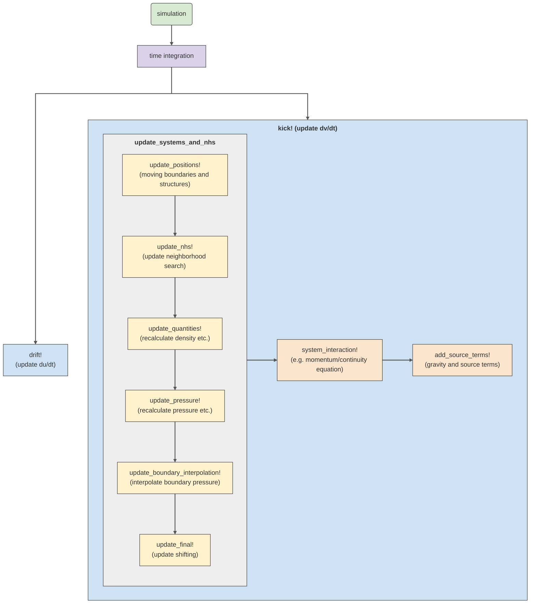

# Overview
The actual API reference is not listed on a single page, like in most Julia packages,
but instead is split into multiple sections that follow a similar structure
as the code files themselves.
In these sections, API docs are combined with explanations of the theoretical background
of these methods.

The following page gives a rough overview of important parts of the code.

## Program flow

To initiate a simulation, the goal is to solve an ordinary differential equation, for example,
by employing the time integration schemes provided by OrdinaryDiffEq.jl. These schemes are then
utilized to integrate ``\mathrm{d}u/\mathrm{d}t`` and ``\mathrm{d}v/\mathrm{d}t``, where ``u``
represents the particles' positions and ``v`` their properties such as velocity and density.
During a single time step or an intermediate step of the time integration scheme, the functions
`drift!` and `kick!` are invoked, followed by the functions depicted in this diagram
(with key parts highlighted in orange/yellow).

## Structure
What we refer to as schemes are various models such as Weakly Compressible Smoothed Particle Hydrodynamics (WCSPH)
or Total Lagrangian Smoothed Particle Hydrodynamics (TLSPH). These schemes are categorized based on the applicable
physical regimes, namely fluid, solid, gas, and others. Each scheme comprises at least two files: a `system.jl` file
and an `rhs.jl` file. The `system.jl` file provides the data structure holding the particles of this scheme and some
routines, particularly those for allocation and the main update routines, excluding system interactions.
The interactions between particles of this scheme (and with particles of other schemes) are handled in the `rhs.jl` file.
