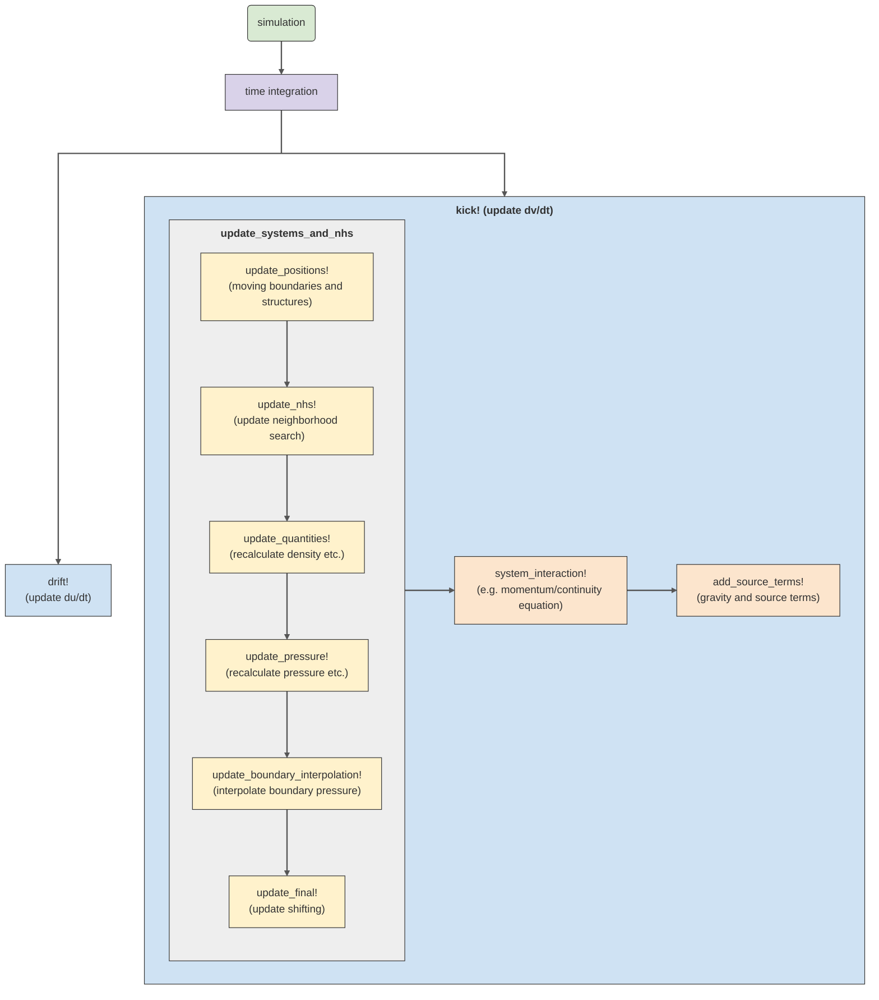

# Overview
The API reference is not collected on a single page.
Instead, it is split into sections that largely mirror the source tree.
These sections combine API documentation with short explanations of the
underlying methods.

The following page gives a rough overview of important parts of the code.

## Program flow

To run a simulation, TrixiParticles.jl solves an ordinary differential equation,
typically with a time integration scheme from OrdinaryDiffEq.jl. These schemes are
used to integrate ``\mathrm{d}u/\mathrm{d}t`` and ``\mathrm{d}v/\mathrm{d}t``,
where ``u`` represents particle positions and ``v`` particle properties such as
velocity and density.
During a single time step or an intermediate step of the time integration scheme, the functions
`drift!` and `kick!` are invoked, followed by the functions depicted in this diagram
(with key parts highlighted in orange/yellow).

```mermaid
%% Make arrows bend at right angles
%%{ init : { "flowchart" : { "curve" : "stepAfter" }}}%%

%% TD means vertical layout
flowchart TD
    %% --- Define color palette and styles ---
    classDef start_node fill:#d9ead3,stroke:#333,color:#333
    classDef time_integration fill:#d9d2e9,stroke:#333,color:#333
    classDef primary_stage fill:#cfe2f3,stroke:#333,color:#333
    classDef update fill:#eeeeee,stroke:#333,color:#333
    classDef updates fill:#fff2cc,stroke:#333,color:#333
    classDef physics fill:#fce5cd,stroke:#333,color:#333

    A(simulation) --> B[time integration];

    %% Add hidden dummy node to branch the arrow nicely
    B --- dummy[ ];
    style dummy width:0;
    dummy --> C["drift!<br/>(update du/dt)"];

    subgraph kick["<div style='padding: 10px; font-weight: bold;'>kick! (update dv/dt)</div>"]
        %% Horizontal layout within this subgraph
        direction LR;

        subgraph updates["<div style='padding: 10px; font-weight: bold;'>update_systems_and_nhs</div>"]
            %% Vertical layout within this subgraph
            direction TB;

            H["update_positions!<br/>(moving boundaries and structures)"];
            I["update_nhs!<br/>(update neighborhood search)"];
            J["update_quantities!<br/>(recalculate density etc.)"];
            K["update_pressure!<br/>(recalculate pressure etc.)"];
            L["update_boundary_interpolation!<br/>(interpolate boundary pressure)"];
            M["update_final!<br/>(update shifting)"];

            H --> I --> J --> K --> L --> M;
        end

        F["system_interaction!<br/>(e.g. momentum/continuity equation)"];
        G["add_source_terms!<br/>(gravity and source terms)"];

        updates --> F --> G;
    end

    dummy --> kick;

    %% Color the sub-tasks by their function
    class A start_node;
    class B time_integration;
    class C primary_stage;
    class kick primary_stage;
    class updates update;
    class H,I,J,K,L,M updates;
    class F,G physics;

    %% Style the arrows
    linkStyle default stroke-width:2px,stroke:#555
```

## Structure
In the codebase, a scheme denotes a particle method or model such as Weakly Compressible
SPH (WCSPH) or Total Lagrangian SPH (TLSPH). Schemes are organized by application area,
for example fluid, structure, and boundary systems. A scheme typically comprises at least
two files: a `system.jl` file and an `rhs.jl` file. The `system.jl` file defines the data
structure that stores the particles of the scheme together with routines for allocation and
main updates that do not involve particle interactions. The `rhs.jl` file contains the
interaction terms between particles of the same scheme and between different schemes.
