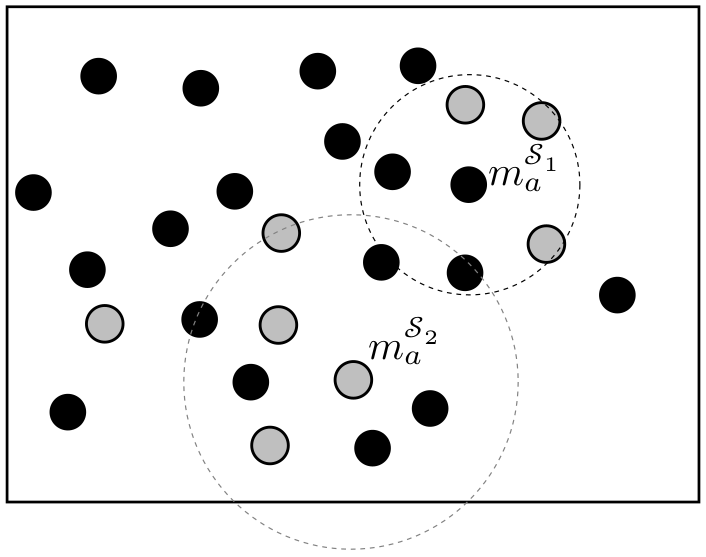
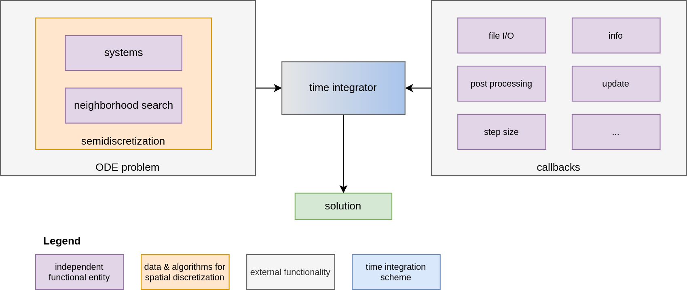
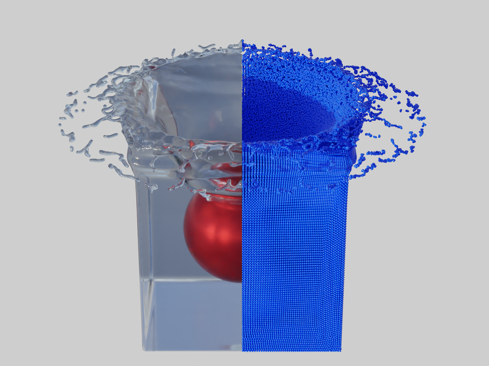

# Summary

TrixiParticles.jl, part of the Trixi Framework [@schlottkelakemper2020trixi], is an innovative Julia-based open-source software designed for particle-based multiphysics simulations.
It aims to handle complex geometries and specialized applications, such as computational fluid dynamics (CFD) and structural dynamics,
by offering a versatile platform for particle-based methods.
To increase flexibility, TrixiParticles.jl facilitates the easy addition of new particle systems and their interactions.
Coupling of different particle systems is very user friendly, thus, e.g. fluid-structure interaction (FSI) can be set up very quickly.
This is further complemented by allowing simulations to be configured directly with Julia code.
This feature not only simplifies the integration of custom functionalities but also promotes rapid prototyping,
establishing TrixiParticles.jl as a versatile and adaptable tool for advancing multiphysics simulations in various scientific and engineering fields.

Here, we give a brief overview of the software package TrixiParticles.jl, starting with a description of the scientific background before going on to describe the functionality and benefit in more detail.
Finally, a few exemplary results and implemented features are briefly presented.

# Statement of need

Numerical simulations, such as CFD, structural mechanics, thermodynamics, or magnetohydrodynamics pose several challenges, especially when simulating real-world problems.
These simulations involve challenges such as dealing with complex geometries, free surfaces,
deformable boundaries and moving material interfaces as well as the coupling of different physics disciplines.

One way to ease these challenges is to use particle-based methods.
These methods offer two different approaches: the particles are either treated as physical particles or as mathematical interpolation points.
The former case refers to methods that model separate, discrete particles with rotational degrees of freedom such as the Discrete Element Method (DEM) proposed by [@Cundall:1979].
Whereas the latter case refers to the smoothed particle hydrodynamics (SPH) which is a numerical discretization method for solving continuum mechanic problems.
SPH was originally developed by [@Monaghan:1977] to simulate astrophysical applications and is now widely used to simulate computational fluid dynamics, structural mechanics and even heat conduction problems.

The Lagrangian formalism in particle-based methods allows particles to move along a velocity field without any connection to neighboring particles,
thus eliminating the need for a mesh to discretize the simulation domain.
This mesh-free approach not only simplifies the preprocessing, making it particularly suitable for simulating complex geometries,
but it also facilitates simulations of large deformations and movements.
By representing each material with its own set of particles,
coupling of different single-phyiscs into a multiphysics system is straightforward.
In addition, particle-based methods are inherently suited to simulating free surfaces, material interfaces and challenges involving moving boundaries.

There are several open-source software projects specialized for SPH methods, including DualSPHysics [@Dominguez:2021], SPlisHSPlasH [@Bender] and SPHinXsys [@Zhang:2021],
written in C++, and  PySPH [@Ramachandran:2021], written in Python.
These softwares reflect the advantages of the SPH methods by simulating problems such as fluid-structure interaction (FSI) and free surfaces [@O_Connor:2021] or complex geometries [@Laha:2024].

TrixiParticles.jl is written in Julia and thus combines the advantage of easy and rapid prototyping with the ability of high performance computing using multicore parallelization and hardware accelerators.
The software package provides support for developing and testing new SPH methods and also for simulating and coupling other particle-based methods such as DEM.
Another aspect is the ability to add custom methods or particle interactions without modifying the source code, since each simulation is configured and set up by pure Julia code.

# Overview of particle-based simulation

In TrixiParticles.jl, particles of a single particle-based method are grouped into what we refer to as a \emph{system}.
The interaction between two particles is defined by the types of their systems. This approach makes it easy to add new methods and different physics.

{width=40%}

To illustrate this, \autoref{fig:systems} depicts particles within a simulation domain. The black particles belong to system $\mathcal{S}_1$ and the gray particles belong to system $\mathcal{S}_2$.
In general, the force $f_a$ experienced by a particle $a$ is calculated as
$$ f_a = \sum_{b \in \mathcal{S}_1} f_{ab}^{\mathcal{S}_1} + \sum_{b \in \mathcal{S}_2} f_{ab}^{\mathcal{S}_2} + \dots + \sum_{b\in \mathcal{S}_n}f_{ab}^{\mathcal{S}_n}, $$
where the interaction force $f_{ab}^{\mathcal{S}_i}$ that particle $a$ experiences due to particle $b$ depends on the system type of particle $a$, the system type $\mathcal{S}_i$ of particle $b$, and the relative particle distance.
For computational efficiency, only particles with a distance within a system-dependent search radius interact with each other.

For example, the SPH method determines the force between two SPH particles according to [@Monaghan:2005] as
$$ f_{ab} = -m_a m_b \left( \frac{p_a}{\rho_a^2} + \frac{p_b}{\rho_b^2} \right) \nabla_a W_{ab} + \Pi_{ab},$$
where $m_a$, $m_b$, $\rho_a$, $\rho_b$, $p_a$, $p_b$ are the mass, density and pressure of particles $a$ and $b$, respectively. The last term $\Pi_{ab}$ includes dissipative terms such as artificial viscosity [@Monaghan:2005] and is scheme-specific. The weighting function $W_{ab}$, also called kernel-function, depends on the relative distance between particles $a$ and $b$.

# Code structure and features

\autoref{fig:structure} depicts the basic building blocks of TrixiParticles.jl. A simulation essentially consists of spatial discretization (left block) and time integration (center block). For the latter, the Julia package [OrdinaryDiffEq.jl](https://github.com/SciML/OrdinaryDiffEq.jl) is used. The callbacks (right block) provide additional functionality and communicate with the time integration method during the simulation.

The semidiscretization couples the systems of a simulation and also manages the corresponding neighborhood searches for each system.
The resulting ordinary differential equation (ODE) problem is then fed into the time integrator and is solved by an appropriate numerical time integration scheme.

{width=100%}

TrixiParticles.jl is open source and available under the MIT license at [GitHub](https://github.com/trixi-framework/TrixiParticles.jl),  along with detailed [documentation](https://trixi-framework.github.io/TrixiParticles.jl/stable/) explaining how to use it. Additionally, we provide tutorials explaining how to set up a simulation of fluid flows, structure mechanics, or fluid-structure interaction.
A collection of simulation setups to get started with can be found in the examples directory.

## Feature highlights

So far, the following feature highlights have been implemented:

* *Fluid Systems*
    + Weakly compressible SPH (WCSPH): Standard SPH method originally developed by [@Monaghan:1977] to simulate astrophysics applications.
    + Entropically damped artificial compressibility (EDAC) for SPH: As opposed to the WCSPH scheme, which uses an equation of state, this scheme uses a pressure evolution equation to calculate the pressure, which is derived by [@Clausen:2013] and adapted to SPH by [@Ramachandran:2019].

* *Structure Systems*
    + Total lagrangian SPH (TLSPH): Method to simulate elastic structures where all quantities are calculated with respect to the initial configuration [@O_Connor:2021].
    + DEM: Discretization of granular matter or bulk material into a finite set of distinct, interacting mass elements [@Bicanic:2004], [@Cundall:1979].

* *Boundary Systems*
    + Boundary system with several boundary models, where each model follows a different interaction rule.
    + Open boundary system to simulate non-reflecting (open) boundary conditions [@Lastiwka:2009].

* *Correction methods and models*
  + Density diffusion [@Antuono:2010]
  + Transport-velocity formulation (TVF) [@Adami:2013]
  + Intra-particle-force surface tension [@Akinci:2013]

* *Performance and parallelization*
  + Shared memory parallelism using multithreading
  + Highly optimized neighborhood search providing various approaches
  + GPU support

Validation can be performed, for example, by quantitatively comparing results using a post-process callback.
\autoref{fig:beam_y_deflection} shows simulation results of TrixiParticles.jl and [@O_Connor:2021] compared against a reference value of [@Turek:2007].
The plots show the y-deflection of the tip of a beam oscillating under its own weight.
The results obtained with TrixiParticles.jl match those of [@O_Connor:2021].

![Comparison of TrixiParticles.jl and  [@O_Connor:2021] against [@Turek:2007]: Tip y-deflection of an oscillating beam with different resolutions, where $t_s$ is the thickness of the beam and $dp$ is the particle spacing. \label{fig:beam_y_deflection}](oscillating_beam.png){width=60%}

\autoref{fig:falling_sphere} illustrates an exemplary simulation result, where an elastic sphere, modeled with TLSPH, falls into a tank filled with water, modeled by WCSPH.

{width=100%}

# Acknowledgements

The project has benefited from funding from [hereon](https://www.hereon.de/) and [HiRSE](https://www.helmholtz-hirse.de/).

# References
