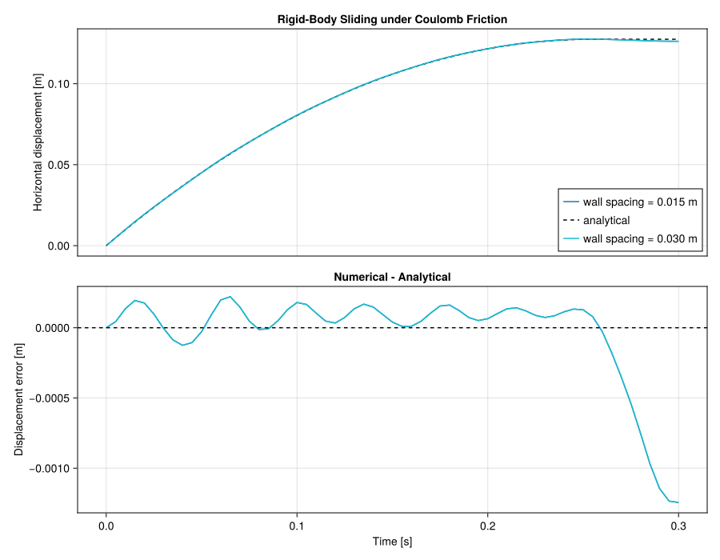

# 2D Rigid-Body Sliding Validation

This validation reuses
`examples/structure/sliding_rigid_squares_friction_2d.jl` through `trixi_include` and compares
kinetic rigid-wall friction against the analytical stopping distance of a body sliding on a
horizontal plane,

```math
s = \frac{v_0^2}{2 \mu_k g}.
```



The comparison assumes that the body starts in contact, remains in the kinetic-slip regime
until stopping, and experiences a constant normal load equal to its weight. The script runs
kinetic friction coefficients `0.2`, `0.3`, and `0.4` at wall spacing `0.03`. It also repeats
the `0.4` case at wall spacing `0.015` as a separate resolution-independence check. The plot
shows the friction-factor sweep; wall resolution is reported as a scalar error because its
trajectories intentionally overlap. Numerical trajectories are written to JSON and CSV in
`out/validation_result_rigid_body_sliding_2d_mu_*_wall_spacing_*`; the analytical trajectory
is added to each JSON file for plotting.

The following files are provided:

1. `validation_rigid_body_sliding_2d.jl`: Runs the example for the friction-factor sweep and
   wall-resolution check, then computes the stopping-distance and resolution errors.
2. `plot_rigid_body_sliding_results.jl`: Optionally plots the numerical and analytical
   trajectories and their signed errors after validation has generated its output files.

Run the validation from the repository root with

```bash
JULIA_LOAD_PATH="@:$PWD:@stdlib" julia --project=test \
  validation/rigid_body_sliding_2d/validation_rigid_body_sliding_2d.jl
```

Then create the comparison plot with

```bash
JULIA_LOAD_PATH="@:$PWD:@stdlib" julia --project=test \
  validation/rigid_body_sliding_2d/plot_rigid_body_sliding_results.jl
```

Set `save_figure = true` to regenerate `rigid_body_sliding_2d.svg` in this directory.
